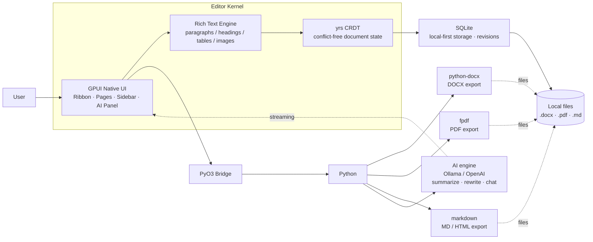

# Sylph

A native, local-first document editor for Linux. Focused on reports and long-form writing with a calm, editorial workstation feel.

## Features

- A4 page-centered workspace
- Rich document model (not just Markdown)
- Structured editing with paragraphs, headings, images, tables, page breaks
- Local-first storage with revision history
- Native Linux desktop (GPUI)

## Structure

```
sylph/
├── apps/desktop/    # Desktop application
├── crates/
│   ├── core/        # Document model & editor kernel
│   ├── storage/     # Persistence layer
│   └── py_bridge/   # Python bindings
├── assets/          # Static assets
└── python/          # Python utilities
```

## Build

```bash
cargo build
```

## Vision

Sylph's vision is to be a **native, local-first document editor**, a Word/Google Docs
replacement built in Rust on the GPUI toolkit, where the architecture is:
**GPUI** (fast native UI) → **yrs CRDT** (conflict-free document state) → **SQLite**
(local-first storage) → **PyO3** (Python for AI + rich export).



And the feature map the final product is aiming at:

```mermaid
flowchart TD
    ROOT[Sylph — final product] --> EDITING[Editing]
    ROOT --> LAYOUT[Layout & Pages]
    ROOT --> FILES[Files & Collaboration]
    ROOT --> AI[AI Assistant]

    EDITING --> RT[Rich text spans<br/>bold · italic · color · fonts]
    EDITING --> FMT[Paragraph styles<br/>alignment · lists · spacing]
    EDITING --> TBL[Editable tables]
    EDITING --> IMG[Resizable / captioned images]
    EDITING --> UNDO[Undo · Redo across all blocks]

    LAYOUT --> PG[Paginated A4 / Letter pages]
    LAYOUT --> HDR[Headers · footers · page numbers]
    LAYOUT --> BREAK[Page & section breaks]
    LAYOUT --> NA[Footnotes · TOC]

    FILES --> OPEN[Open / Save As<br/>.docx · .md · .pdf]
    FILES --> RT1[DOCX round-trip]
    FILES --> SYNC[CRDT sync]<br/>
    FILES --> REV[Revision history]

```
