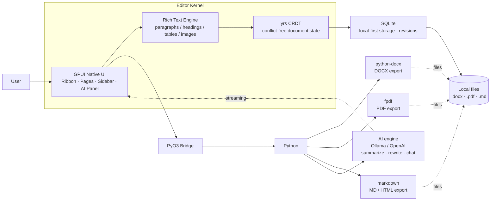
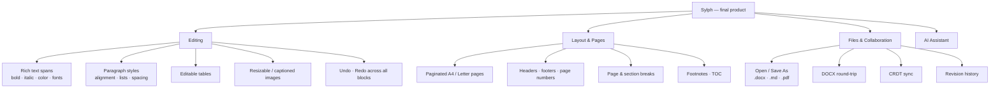

# Sylph

A native, local-first document editor for Linux. Focused on reports and long-form writing with a calm, editorial workstation feel.

> **Note:** I am doing this as a hobby project and learning material as i go and can only give time to it in weekends.

## Features

- A4 page-centered workspace
- Rich document model (not just Markdown)
- Structured editing with paragraphs, headings, images, tables, page breaks
- Local-first storage with revision history
- Native Linux desktop (GPUI)

## Structure

```
sylph/
├── apps/desktop/    # Desktop application
├── crates/
│   ├── core/        # Document model & editor kernel
│   ├── storage/     # Persistence layer
│   └── py_bridge/   # Python bindings
├── assets/          # Static assets
└── python/          # Python utilities
```

## Build

```bash
cargo build
```

## Fonts

Sylph ships its fonts in `assets/fonts/` and loads them at startup, so the
editor looks the same whatever the system has installed. All are under the
SIL Open Font License 1.1; each family's folder has its `OFL.txt`. They are
static instances of the Google Fonts releases.

| Family | Used for | Styles |
| --- | --- | --- |
| EB Garamond | the page (default body font) | Regular, Italic, Bold, Bold Italic |
| Source Serif 4 | body font choice | Regular, Italic, Bold, Bold Italic |
| Lora | body font choice | Regular, Italic, Bold, Bold Italic |
| Hanken Grotesk | the interface | Regular, SemiBold |
| Inter | body font choice | Regular, Italic, Bold, Bold Italic |
| JetBrains Mono | code and line numbers | Regular, Bold |
| Noto Sans Devanagari | Devanagari text (script fallback) | Regular, Bold |
| Noto Serif Devanagari | Devanagari text | Regular, Bold |

## Vision

Sylph's vision is to be a **native, local-first document editor**, a Word/Google Docs
replacement built in Rust on the GPUI toolkit, where the architecture is:
**GPUI** (fast native UI) → **yrs CRDT** (conflict-free document state) → **SQLite**
(local-first storage) → **PyO3** (Python for AI + rich export).


```mermaid
flowchart LR
    U[User] --> UI[GPUI Native UI<br/>Ribbon · Pages · Sidebar · AI Panel]

    subgraph EditorKernel [Editor Kernel]
        UI --> RTE[Rich Text Engine<br/>paragraphs / headings / tables / images]
        RTE --> CRDT[yrs CRDT<br/>conflict-free document state]
    end

    CRDT --> STORE[SQLite<br/>local-first storage · revisions]
    STORE --> FS[(Local files<br/>.docx · .pdf · .md)]

    UI --> BRIDGE[PyO3 Bridge]
    BRIDGE --> PY[Python]
    PY --> DOCX[python-docx<br/>DOCX export]
    PY --> PDF[fpdf<br/>PDF export]
    PY --> MD[markdown<br/>MD / HTML export]
    PY --> AI[AI engine<br/>Ollama / OpenAI<br/>summarize · rewrite · chat]

    AI -. streaming .-> UI
    DOCX & PDF & MD -. files .-> FS
```

And the feature map the final product is aiming at:


```mermaid
flowchart TD
    ROOT[Sylph — final product] --> EDITING[Editing]
    ROOT --> LAYOUT[Layout & Pages]
    ROOT --> FILES[Files & Collaboration]
    ROOT --> AI[AI Assistant]

    EDITING --> RT[Rich text spans<br/>bold · italic · color · fonts]
    EDITING --> FMT[Paragraph styles<br/>alignment · lists · spacing]
    EDITING --> TBL[Editable tables]
    EDITING --> IMG[Resizable / captioned images]
    EDITING --> UNDO[Undo · Redo across all blocks]

    LAYOUT --> PG[Paginated A4 / Letter pages]
    LAYOUT --> HDR[Headers · footers · page numbers]
    LAYOUT --> BREAK[Page & section breaks]
    LAYOUT --> NA[Footnotes · TOC]

    FILES --> OPEN[Open / Save As<br/>.docx · .md · .pdf]
    FILES --> RT1[DOCX round-trip]
    FILES --> SYNC[CRDT sync]
    FILES --> REV[Revision history]

```
