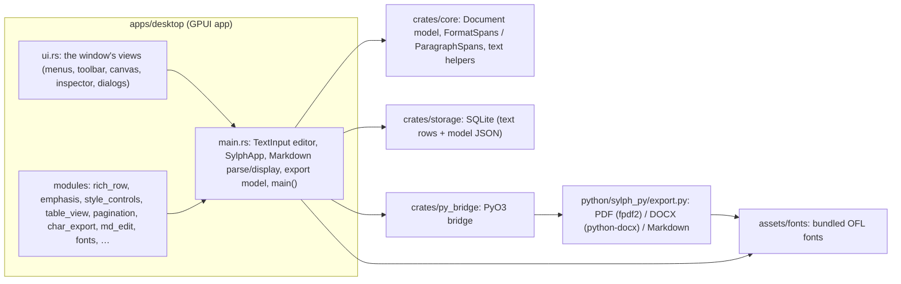

# Sylph codebase map (pseudocode)

A map of the whole code base as of 2026-10-03, for the author and for any
agent: what each part holds, and how a key press becomes pixels, a saved
row and an exported page. Pseudocode mirrors the Rust/Python closely; file
names are given so you can jump to the real code. Keep this file in step
when modules move or change.



## 1. What a document is

A document is **three things saved together**:

```text
Document text  = one String in the editor (TextInput.content)
                 Markdown-flavoured when Markdown mode is on: "# " headings, "- " lists,
                 "**bold**", pipe tables, "\newpage" page breaks, "" …
                 Every line (every Enter) is one paragraph.

Document model = sylph_core::document::Document, saved as JSON:
  page_size, page_margins, landscape
  styles:   line_spacing, body_font, body_font_size, space_before/after   (Normal)
            heading_styles[1..6] { size, font, line_spacing, space_before/after }  (None = default)
  markdown: bool                     -- Markdown mode for this document
  char_formats: FormatSpans          -- [start,end) byte ranges → CharFormat {size, font, bold, italic, underline, strike}
  para_formats: ParagraphSpans       -- whole-line ranges → ParaFormat {align, line_spacing, space_before/after}
  blocks: cover page, inserted images/tables (legacy; typed content lives in the text)

Title          = documents.title (SQLite)
```

Formatting resolution, exactly like Word: **style → paragraph format → character format**.

```text
resolved(position):
  style   = document.resolved_style(heading level of the line, 0 = Normal)
  para    = para_formats.format_at(start of the line)      -- overrides style spacing / alignment
  chars   = char_formats.format_at(position)               -- overrides size / font / bold …
  markdown/style emphasis (`**`, heading bold) applies unless chars says Some(false)
```

`crates/core/src/format.rs` — spans that follow the text:

```text
Spans<F>  (FormatSpans = Spans<CharFormat>, ParagraphSpans = Spans<ParaFormat>)
  spans: sorted, non-overlapping, non-empty [(start, end, F)]

  format_at(offset)          → F of the span containing offset, else default
  runs(range)                → range cut where F changes (gaps = default)
  apply(range, change)       → split spans at range edges, change(F) on every piece, merge equal neighbours
  edit(start, removed, ins)  → after a text edit: shift spans after it, shrink spans inside the removed part,
                               grow the span the insertion lands in (typing continues the formatting before it)
  clamp_to(text)             → repair after load (ranges inside text, on char boundaries)

paragraph_range(text, a, b)  → first line start .. last line end + its "\n" (so Enter carries paragraph format)
```

## 2. The editor: `TextInput` (main.rs)

```text
struct TextInput {
  content: String, selected_range, selection_reversed
  formats: FormatSpans, para_formats: ParagraphSpans, pending_emphasis   -- formatting being edited
  undo_stack / redo_stack: [EditAction { start, old_text, new_text, selection_before,
                                         formats_before/after, paras_before/after, at }]
  storage: Storage, doc_id, save_state, save_task                         -- persistence
  markdown_mode, styles[0..6] (resolved), page_flow                       -- layout inputs
  last layout: display_lines, row_metas, all_lines (RowText per row), content_height, page_count, cursor_page
}
```

Every text change goes through **one** function:

```text
replace_text_in_range(range = selection, new_text):
  if read_only: return
  new_text = normalize_newlines(new_text)            -- no "\r" ever enters
  old = content[range]; formats_before = formats; paras_before = para_formats
  apply_edit(range, new_text):
      content.replace_range(range, new_text)
      formats.edit(…); para_formats.edit(…)          -- formatting moves with the text
      content_rev += 1; caret after new_text; schedule_save()
  apply_pending_emphasis(inserted range)              -- Ctrl+B with only a caret, then typing
  undo: if undo_group::merge(last step, this edit) is Typing/Backspace/ForwardDelete
           → extend the last step (undo takes back a word)
        else push EditAction
```

Keys (`key_bindings()` in main.rs) map to actions; the special ones:

```text
Enter:      in a list (md_edit::list_enter) → "\n- " / "\n2. " / end the list on an empty item
            else "\n"
Tab:        in a table → next cell (table_view::table_tab); in a list → deeper level; else 4 spaces
Backspace:  at a table cell border → nothing; next to a page break → remove the whole "\newpage" line
Ctrl+Enter: insert "\newpage" line at the caret (pagination::page_break_insertion)
Ctrl+B/I/U: SylphApp::toggle_emphasis (see §6)
Ctrl+L/E/R/J: alignment → TextInput::format_paragraphs(|p| p.align = …)
```

## 3. From text to pixels (one frame)

`TextElement::prepaint` in main.rs, helped by `rich_row.rs`, `pagination.rs`, `table_view.rs`:

```text
lines = content.split("\n")
display_lines = build_display_lines(lines, markdown_on)
    each line → display_line(): hides Markdown syntax (DisplayBuilder hide/ident/inline/replace),
                records segments (source↔display byte maps), styles (bold/italic/code/link ranges),
                kind (Paragraph, Heading(level), List, Quote, Code, Rule, PageBreak), font_size
    table lines → table_view::display_row(): cells' text, pipes hidden, U+001F between cells

for each display line i:
    style  = styles[heading level]          para = para_formats.format_at(line start)
    text_height, space_before/after from style, overridden by para
    rows = wrap(display text, available width, char formats)      -- RowText::shape measures real mixed sizes
    for each row:
        runs    = display_runs (Markdown on) | markdown_runs (Markdown off)   -- colours, fonts from Markdown
        formats = rich_row::line_formats(dl, row range, char formats)        -- per displayed character:
                     source byte = dl.char_src(display index); format = formats.format_at(source byte)
        shaped  = RowText::shape(runs split at format changes; one GPUI shape_line per font size)
                | shape_justified (justify) | shape_cells (table row, each cell at its column)
        shaped  = offset for centre/right alignment, hanging indent for list continuation rows
        height grows for bigger words
        box_top = page_flow.place(y, height)   -- moves to the next page if it does not fit
        after a "\newpage" line: y = next page top
    caret / selection quads from the rows; canvas scrolls to follow the caret (caret_scroll_offset)

paint: table grids, rules, each RowText.paint (segments on one baseline), caret, selection
```

Hit-testing (`index_for_mouse_position`): last row starting above the click → `RowText.closest_index_for_x`
→ display index → `dl.disp_to_src` (caret position; after hidden syntax it lands on the visible text).

## 4. The application: `SylphApp` (main.rs + ui.rs + modules)

```text
struct SylphApp {
  editor: Entity<TextInput>, document: Document (model), persisted_model
  doc_title, documents list, revisions, overlay, pickers, find bar, palette, status message, …
}

render (ui.rs):  title bar · menu bar · format bar (style_controls pickers, B I U S, alignment, lists)
                 · navigator (outline / pages / assets) · canvas (cover page, body pages, editor) ·
                 inspector (paragraph / image / history) · status bar (page, words, save state)
                 · overlays (palette, export, page setup, insert table, shortcuts, word count, context menu)

observers:
  observe(editor)  → copy editor.formats / para_formats into document (model is what gets saved)
  observe_self     → sync_editor_styles (resolved styles into the editor) ;
                     persist_model_if_changed (format-only changes debounced 750 ms)
```

Module by module:

```text
style_controls.rs  Style / Font / Size / Spacing pickers. Selection → character format;
                   caret only → the caret's style (or "This paragraph" for spacing). Alignment.
emphasis.rs        TextView (text + formats + display lines) decides B/I/U/S toggles (§6)
table_view.rs      cells of a pipe table line, display_row, Tab between cells, column widths in
                   the |----|--| dashes, ColumnDrag (resize), TableCommand (insert/delete rows/cols)
pagination.rs      PageFlow.place / page_of, \newpage editing (backspace/delete), caret scroll
md_edit.rs         list markers (Enter/Tab/Shift+Tab), hanging indent, document outline
char_export.rs     RunFormat: text slices + char/paragraph formats → export runs (§7)
rich_row.rs        RowText (segments of shaped text), line_formats, emphasis on runs
fonts.rs           bundled fonts, BODY_FONTS list, FONT_ALIASES (Times New Roman → Liberation Serif …)
undo_group.rs      which edits join one undo step
word_count.rs      counts + Word count dialog
save_state.rs      SaveState (Saved / Saving / Failed / Unpersisted / ReadOnly), load_text_or_read_only
export_job.rs      run_export on a background thread, status message
memo.rs            Memo<K, V> cache (page count, caret status, outline once per edit)
palette.rs         command palette commands + filter
title.rs           confirmed_title (rename)
```

## 5. Saving and loading (crates/storage)

```text
Storage (SQLite, WAL, synchronous=FULL, one connection):
  documents(id, title, updated_at)   crdt_updates(id, document_id, update_blob = full text, created_at)
  document_models(document_id, model_json)   app_state(key, value)

autosave (TextInput.schedule_save): 750 ms after the last edit → save_text(doc, text)
  write_save: if the newest row is < 5 min old → replace it (bounded growth) else insert a new version
save_current_document (switch/new/quit): save_snapshot(doc, text, model_json) in ONE transaction
restore version: save_revision (always a new row)
load: load_text (invalid UTF-8 → read-only document), load_model (bad JSON → recovered/ copy),
      migrate old page-break blocks into "\newpage" lines, clamp formats to the text
no database → in-memory + permanent "NOT SAVING" state
```

## 6. Bold / italic / underline / strike (the recent bug, step by step)

```text
Ctrl+B  →  SylphApp::toggle_emphasis(Bold)  →  TextInput::toggle_emphasis(Bold)

range = selection
if range is empty:
    if caret is inside a word: range = that word                       (Word's behaviour)
    else: pending_emphasis = [(Bold, on)] for the next typed text; return
(on, formats) = TextView::toggled(range, Bold):
    on = !all_have(range, Bold)
    all_have(range): every character that is (a) not a space and (b) SHOWN on the page
                     has emphasis_at(char) == true
    emphasis_at(char): char_formats.format_at(char).bold if set,
                       else the Markdown/style bold of that character (dl.styles, heading, table header)
    formats.apply(range, bold = Some(on))
push one undo step; schedule save

Rendering a row: line_formats(dl, row) gives each displayed character its CharFormat via
dl.char_src(display index) → apply_emphasis on that run piece (font.bold() / italic / underline / strike)
```

**What was wrong (fixed 2026-10-03, scenario tests in `emphasis.rs` `bold_scenarios`):**

1. *Missing font faces.* Hanken Grotesk had no Bold/Italic face and JetBrains Mono no Italic. GPUI
   does not synthesise styles, so bold/italic simply did not show in those fonts. → all body fonts
   now ship four faces; `every_body_font_has_bold_and_italic_faces` enforces it.
2. *First letter after hidden syntax.* `line_formats` mapped a displayed character back to the
   source with `disp_to_src`, which answers "where does a caret go" — at the start of text that
   follows hidden `**` it returned the marker's byte. So in `**bold**rest`, bolding `rest` showed
   `est`. → `char_src` maps characters; `disp_to_src` stays for carets.
3. *Un-bolding Markdown bold did nothing.* `all_have` counted the hidden `**` bytes inside the
   selection; they are not bold, so "all bold?" was false and Ctrl+B turned bold *on* again (no
   visible change). → hidden syntax is skipped like spaces (`is_shown`).

Export of the same formatting: `char_export::emphasis_into_styles` turns bold/italic/underline/strike
into the run's style flags (`Bold`, `Italic`, `BoldItalic`, `Underline`, `Strikethrough`), which the
Python exporters already render.

## 7. Export (char_export.rs, main.rs `export_model`, py_bridge, export.py)

```text
export_document(format):  Save dialog → snapshot on the UI thread → background thread → status bar
  json = serde_json(export_model(document, text, markdown_on))
  export_model:
     blocks = cover page
            + parse_content_blocks_with(text, RunFormat::with(text, char_formats).with_paragraphs(para_formats))
                (Markdown on: headings, lists, quotes, code, tables (column widths from dashes),
                 images, \newpage; every line its own paragraph)
            | literal_blocks_with(...)  (Markdown off: one paragraph per line, \newpage still breaks)
            + inserted blocks (images/tables from the model)
     each run carries size/font (format) and bold/italic/… (styles); each paragraph its alignment
     and spacing (style), headings their alignment
  sylph_py_bridge::export_rich_{pdf,docx,markdown}(json, path)
     python dirs from trusted places only (CWE-427); fonts_dir → export.configure()

export.py:
  rich_pdf:  fpdf2, bundled fonts registered, HarfBuzz shaping, fallback fonts, page setup,
             each paragraph written as ONE text-flow paragraph (words never split at style changes),
             heading styles, tables with column widths, warnings for characters no font has
  rich_docx: python-docx, Word 2013+ compatibility, style fonts/sizes/spacing, Devanagari cs font,
             runs (bold/italic/underline/size/font), alignment, tables (column widths), hyperlinks
  rich_markdown: plain Markdown back
```

## 8. Tables (table_view.rs)

```text
A table is pipe-table text:   | Head | Head |      header (drawn shaded)
                              |------|---|          delimiter: dash counts = column widths
                              | cell | cell |      body rows

display: cells only, drawn in a grid (equal width → fractions from dashes)
click a cell → caret in that cell; typing "|" → "\|"; Tab / Shift+Tab → next / previous cell
drag a border → ColumnDrag.drag_to(x) → on release rewrite the delimiter with new dash counts
right-click → TableCommand: insert row above/below, column left/right, delete row/column/table
cannot hold (yet): cell colours, padding, borders, merges, several paragraphs per cell
   → plan: TableProps beside the text, then tables as objects (see improvement-plan research)
```

## 9. Python bridge safety and fonts (crates/py_bridge)

```text
python_dirs(mode, exe, env):
  release: only <exe>/../lib/sylph/python, refused if group/world-writable
  debug:   + repo python/, repo .venv site-packages, $VIRTUAL_ENV
install once (OnceLock) at the front of sys.path; import only sylph_py.*
fonts_dir: <exe>/../share/sylph/fonts or repo assets/fonts → export.configure(fonts_dir)
```

## 10. Checks

```text
scripts/verify.sh [python]: fmt · clippy -D warnings · core+storage tests · desktop tests ·
                            (python bridge clippy + tests) · headless exports of fixtures/kitchen-sink.md
```
