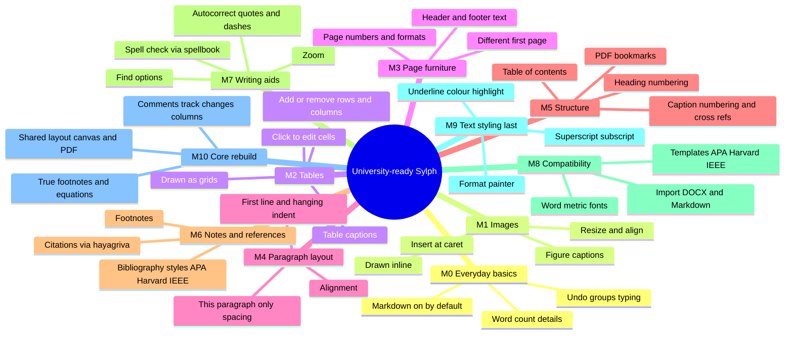

# Sylph improvement plan

This is the plan every agent (Claude, Codex, OpenCode or a human) works
from. The rules for working on it are in [AGENTS.md](../AGENTS.md). Below
the status table is the plan as the author adopted it on 2026-09-27; line
numbers in it come from the audited snapshot, so grep for the symbol before
editing.

## Status (update when a task lands)

| Task | State | Notes |
| --- | --- | --- |
| 0.1 Test isolation | done | bridge tests use a per-process temp dir; Python tests behind `--features python-tests` |
| 0.2 Indented-list panic | done | regression + exhaustive sweep in `indented_list_tests` |
| 0.3 Non-ASCII find | done | Devanagari/café asserts |
| 0.4 CRLF normalisation | done | `normalize_newlines` at every edit and load |
| 0.5 `img()` paths | done | logo returns in 7.1 |
| 0.6 Plaintext side files | done | no `document.txt`/`summary.txt` writes |
| 0.7 Atomic, durable, bounded saves | done | WAL, `synchronous=FULL`, one-transaction `save_snapshot`, 5-minute growth cap, `save_revision` for restores |
| 0.8 Never pretend to save | done | `SaveState::{Failed, Unpersisted, ReadOnly}`, NOT SAVING chip, unreadable documents open read-only |
| 0.9 Python search path | done | `python/sylph_py` package, `python_dirs`, release trusts only `<exe>/../lib/sylph/python` |
| 0.10 Off the UI thread | done | exports, image copies and AI chat run on background threads |
| 0.11 Bundled fonts | done | static OFL instances in `assets/fonts`; Noto Devanagari has `m` (checked) |
| 0.12 Unicode PDF | done | embedded fonts, HarfBuzz shaping, Devanagari fallback, warnings for uncovered characters |
| 1.2 Markdown flag | done | saved per document in the model |
| 1.3 Title rename | done | double-click the title or File → Rename… |
| 1.4 Honest chrome | partial | palette works (filter, ↑/↓, Enter; lists and code blocks); zoom label still static |
| 1.5 Dead code | done | `CrdtDocument` + `yrs`, `Caption`, `RewriteText`, `rewrite_text`, `save_image`, `markdown_to_markdown` removed |
| 1.9 Derived stats per edit | partial | page count, caret status and outline cached by `content_rev`; canvas layout still per frame |
| 1.11–1.13 Splitting main.rs/ui.rs | started | this session's helpers live in `save_state`, `export_job`, `fonts`, `memo`, `md_edit`, `palette`, `title` modules |
| 5.3 DOCX complex script (early part) | partial | DOCX declares Word 2013+ (no Compatibility Mode); styles carry a Devanagari `w:cs` font and `ne-NP`; fonts are not embedded |
| Paragraph styles (author request) | done | Normal + Heading 1–6 each have line spacing and font; Style/Font/Line spacing dropdowns act on the caret's style; canvas, PDF and DOCX follow them |
| Export quality (author request) | done | PDF: no mid-word breaks at font changes, real bullets, strikethrough, task boxes; DOCX: headings bold and black, Word 2013+ mode; three more bundled fonts (Source Serif 4, Lora, Inter) |
| Style size and paragraph spacing (author request) | done | size box, Space before/after act on the caret's style; canvas spaces Normal paragraphs where the export does |
| Print-layout pagination (author request) | done | rows flow page to page (overflow and `\newpage`); click any page to put the caret there; Ctrl+Enter breaks at the caret; the canvas follows the caret |
| Page breaks like Word (author request) | done | Backspace/Delete remove a break whole; old break blocks move into the text on load; break marker drawn in both modes; Pages tab jumps to a page; cover page has a Remove button |
| Character formatting (author request) | done | size and font on selected text as ranges over the text (Google Docs model); mixed sizes on one line; PDF/DOCX carry them |
| Roadmap M0 everyday basics | done | undo groups typing (word / Backspace runs / 1 s pause); new documents start with Markdown on; Word count dialog (click the count) with selection counts |
| Roadmap M4 (part) paragraph layout | done | every Enter is a paragraph in export too; alignment left/centre/right/justify (Ctrl+L/E/R/J, toolbar, Format menu) as paragraph ranges; Spacing dropdown applies to "This paragraph" or the style; PDF/DOCX follow |
| Lists like Word | done | Enter continues a list / ends it on an empty item; Tab / Shift+Tab change the level; wrapped items hang under their text; toolbar bullet/numbered buttons |
| Roadmap M2 (part) tables on the page | done | Markdown tables drawn as grids (header shaded, cells clipped, equal columns as exported); click into cells; Tab / Shift+Tab move between cells, Tab in the last cell adds a row; typed `|` escaped; Backspace/Delete stop at cell borders. Open: column resizing, add/remove column, cell wrapping |
| everything else | open | |

## University-ready roadmap (adopted 2026-10-03; personal use first)

Goal: Sylph can produce a proper university document — report, essay,
dissertation chapter — without leaving the app: title page, numbered
headings, table of contents, figures and tables with captions, citations
and a bibliography, footnotes, page numbers, and a PDF/DOCX that matches
the page. Extensive text styling (colour, highlight, super/subscript)
comes last, as the author asked.

### Where Sylph stands against Word / Google Docs

| Capability a university document needs | Word / Docs | Sylph today |
| --- | --- | --- |
| Styles (Normal, Heading 1–6) with font, size, spacing | yes | yes |
| Size / font on selected words | yes | yes (character formatting spans) |
| Pages, page breaks, click any page | yes | yes |
| Cover / title page | yes | yes (templates) |
| Images at the cursor, resize, caption | yes | **no**: inserted images go after all text; typed `` shows as text |
| Tables drawn as grids, edit cells, add rows | yes | **no**: pipe tables show as raw `|` text; inserted tables go after all text |
| Header / footer, page numbers, different first page | yes | **partial**: PDF footer "Page n/N" only |
| Alignment (centre, justify), first-line / hanging indent | yes | **no** |
| Table of contents with page numbers | yes | **no** |
| Heading numbering (1, 1.1), figure/table numbering, cross-refs | yes | **no** |
| Footnotes | yes | **no** |
| Citations + bibliography (APA, Harvard, IEEE) | yes (built in / add-ons) | **no** |
| Spell check | yes | **no** |
| Undo that groups typing | yes | **no** (one step per key) |
| Word count of selection, details | yes | **partial** (whole document) |
| Open / import DOCX, Markdown | yes | **no** (export only) |
| Word-standard fonts (Times New Roman, Arial, Calibri) | yes | **no** (6 bundled OFL families) |
| Underline, colour, highlight, super/subscript | yes | **no** (last) |
| Equations, comments, track changes, columns | yes | **no** (later) |

### Model decision: text + ranges + anchors (the Google Docs model)

Keep what works and extend it instead of a big-bang rewrite:

- **Text** stays one string. Markdown syntax keeps meaning what it means
  today (headings, lists, quotes, code, pipe tables, ``, `\newpage`),
  hidden by the WYSIWYG canvas, so the exporters keep working.
- **Character ranges** (`FormatSpans`, done) carry what Markdown cannot:
  size, font — later underline, colour, highlight, super/subscript.
- **Paragraph ranges** (`ParagraphSpans`, M4) carry alignment, indents and
  per-paragraph spacing; same edit-shifting code as character ranges.
- **Objects are lines in the text** (an image line, a table, `[[toc]]`,
  `[^1]` footnote refs, `[@key]` citations), so they sit where the caret
  put them and undo/copy/delete work for free. The canvas draws each one
  as the real thing.
- The user never has to type Markdown: every object comes from the Insert
  menu, toolbar or palette, which writes the syntax for them.

```text
resolve(position) = style(paragraph) ← paragraph_spans(paragraph) ← char_spans(position)
render(line)      = object? draw_object(line) : rows(text, char_spans, paragraph_spans)
export(text)      = parse(text) → blocks with runs carrying char + paragraph formatting
```

### Mind map



### Milestones in order (pseudocode and UX per card)

**M0 Everyday basics (1 weekend)**
- Undo groups typing like Word: consecutive single-character inserts (or
  deletes) at the caret merge into one step until a word boundary, a caret
  jump or a 1 s pause.
  ```text
  on edit(e): last = undo.top
    if e.is_typing && last.is_typing && e.start == last.end && !boundary(e) && now - last.at < 1s
        last.extend(e) else undo.push(e)
  ```
- Word count dialog (click the count): words, characters with/without
  spaces, paragraphs, pages; with a selection, the selection's counts.
- New documents start with Markdown (formatting) on.

**M1 Images in the flow (1–2 weekends)**
- UX: Insert → Image (or paste) puts the image *at the caret* on its own
  line; click selects it (handles + Image inspector: width %, alignment,
  caption, alt text); drag a corner to resize; Delete removes it.
- Text: `{width=60%}` (pandoc attribute syntax).
  ```text
  insert_image(path): text.insert(caret_line_end, "\n{width=100%}\n")
  display_line(image line) → DisplayKind::Image { path, width, caption }
  prepaint: image row height = natural_height * width_px / natural_width (decoded off-thread, cached)
  paint: paint_image(row bounds); caption row under it ("Figure n: caption")
  export: parse attrs → Block::Image { width, caption } (exporters already take both)
  ```
- Tests: attribute parsing, insertion at caret, export width/caption.

**M2 Tables on the page (2–3 weekends)**
- UX: Insert → Table (grid picker) at the caret; the canvas draws a grid;
  click a cell and type; Tab / Shift+Tab move between cells; right-click:
  insert/delete row/column; Table inspector: header row, column widths,
  caption.
- Text stays a pipe table; each cell maps to a source range.
  ```text
  table_layout(lines) → rows[cells{src_range, display_text}], col_widths
  click(x, y) → cell → caret = cell.src_range.start + index_in_cell(x)
  type in cell → edit inside src_range only (`|` typed is escaped as \|)
  Tab → caret to next cell (append a row at the end, like Word)
  ```

**M3 Page furniture (1–2 weekends)**
- Model: `header { left, center, right }`, `footer { … }` with fields
  `{page} {pages} {title} {date}`, `different_first_page`, page number
  format (1, i, I) and start number.
- UX: double-click the top/bottom margin to edit (Word), or Insert →
  Page numbers (position presets).
- Canvas draws them per page; PDF via fpdf2 header()/footer(); DOCX via
  section header/footer with PAGE/NUMPAGES fields.

**M4 Paragraph layout (2 weekends)** — uses `ParagraphSpans`
- Alignment left/centre/right/justify (Ctrl+L/E/R/J), first-line and
  hanging indent, "This paragraph only" spacing in the Spacing dropdown,
  ruler indent handles.
  ```text
  ParagraphSpans = FormatSpans over whole lines (start of first line .. end of last)
  format_paragraphs(selection_lines, change) like format_selection
  prepaint: x0 = indent(first row ? first_line : rest); align: shift each row by (width - row_width) * k
  justify: distribute extra space over the row's spaces (not on the last row)
  export: ParagraphStyle { alignment, indent_first, indent_left } → fpdf2 align, python-docx paragraph_format
  ```

**M5 Structure (2–3 weekends)**
- Table of contents: Insert → Table of contents writes `[[toc]]`; the
  canvas draws entries with dotted leaders and page numbers (from canvas
  layout); click jumps. PDF: fpdf2 `insert_toc_placeholder` +
  `start_section` (also gives PDF bookmarks). DOCX: TOC field prefilled.
- Heading numbering (document option 1 / 1.1 / 1.1.1), figure/table
  numbering in captions, cross-references `@fig:label` → "Figure 3",
  List of figures/tables (`[[lof]]`, `[[lot]]`).

**M6 Notes and references (3–4 weekends)**
- Footnotes: Insert → Footnote (Ctrl+Alt+F) writes `[^n]` at the caret and
  `[^n]: text` at the end; canvas shows a superscript number and the note
  text at the page bottom (pagination reserves its height). PDF/DOCX: real
  footnotes (DOCX footnotes part); interim fallback: endnotes.
- Citations: a References panel (add manually, import BibTeX, edit); Insert
  → Citation writes `[@key, p. 4]`; the `hayagriva` crate (MIT/Apache,
  used by Typst) formats in-text citations and the bibliography in APA 7 /
  Harvard / IEEE (document setting); `[[bibliography]]` or automatic at
  the end. Exports receive pre-formatted text runs.

**M7 Writing aids (2–3 weekends)**
- Spell check: `spellbook` crate (MPL-2.0, Hunspell-compatible) with
  bundled en-GB/en-US dictionaries, checked off the UI thread per changed
  paragraph; wavy underline (GPUI `UnderlineStyle { wavy }`); right-click
  suggestions, "Add to dictionary" (stored in app_state).
- Autocorrect: smart quotes, `--` → —, auto-capitalise sentence starts.
- Find options: match case, whole words. Zoom (Ctrl+scroll, status bar).

**M8 Compatibility (2–3 weekends)**
- Word-metric fonts under their Word names: Liberation Serif/Sans/Mono
  and Carlito/Caladea (all OFL) render "Times New Roman", "Arial",
  "Courier New", "Calibri", "Cambria"; DOCX keeps the Word names.
- Templates: APA 7 student paper, Harvard report, IEEE — styles, margins,
  title page, header/page numbers in one click (File → New from template).
- File → Open/Import: DOCX (python-docx reader → text + spans + styles)
  and Markdown files.

**M9 Text styling (last)** — underline (Ctrl+U), colour, highlight,
superscript/subscript, format painter, custom styles ("Update style to
match selection"); all as `CharFormat` fields, same pipeline as size/font.

**M10 Core rebuild (plan Phases 2–5)** — one layout engine for canvas and
PDF (exact page parity), true footnote placement, equations, comments,
track changes, columns.

### UX rules for every card

- Word/Docs conventions first: same menu names, same shortcuts, same
  right-click items. No feature may require typing Markdown.
- Contextual inspector: what is selected (image, table, heading, text)
  decides the right panel.
- Every action is undoable and reports in the status bar.
- Nothing the UI shows may be fake: unfinished controls are hidden, not
  drawn.

Manual checks still owed by the author are listed in each task's VR boxes.
For `--release` runs from `target/`, link the trusted folders once:
`mkdir -p target/lib/sylph target/share/sylph && ln -s ../../../python target/lib/sylph/python && ln -s ../../../assets/fonts target/share/sylph/fonts`.

---

# Stop Sylph's bleeding, then rebuild its core

Sylph today is **a Markdown-flavoured plain-text editor with document-wide page setup and PDF export, wrapped in chrome that is mostly mock-up**. It has **two reproducible panics** (typing an indented list with Markdown on, and searching for any non-ASCII text, which includes all Devanagari), a PDF export that **silently turns every non-latin-1 character into `?`**, saves that are **non-atomic, grow without bound, run on the UI thread and can silently fall back to an in-memory database**, and a **CWE-427 search-path hole** that lets a `python/` folder near the launch directory run code. None of this needs new architecture to fix: Phase 0 is twelve small, compiling tasks, about four to five weekends of work, and each one lands with a regression test. After that, the research largely confirms the architecture SYLPH_PLAN.md already chose, and it supplies versions, ordering and evidence: split the 7,520- and 3,740-line files; build a gpui-free block kernel with persistent IDs and invertible transactions; keep SQLite, but behind one storage thread with an honest save state and real revisions; own text layout with parley and bundled OFL fonts, so Nepali wraps correctly and the screen matches the PDF; replace the Python exporters with krilla, docx-rs and comrak; add AI natively in Rust later; and adopt no CRDT until a second device exists. Judgment estimates for the whole plan (the research notes' figures for Phases 2–7, this plan's own for Phases 0–1) sum to **roughly 45–65 weekends**, so the most consequential decision is to scope v0.1 narrowly. §5 is a ready-to-paste CLAUDE.md and `.claude/` setup that enforces the author's rules: he reviews diffs, runs the app and commits, and Claude Code never touches AGENT.md, SYLPH_PLAN.md or `research/`.

> **For Claude Code:**
> - Save this file in the repo as `docs/improvement-plan.md`, and the §5 files at the paths shown.
> - Work one task card at a time, in order (`/task 0.2`).
> - Every `file:line` reference points into the audited snapshot (a zip copy with no `.git`, audited 2026-09-26/27). Those numbers drift after the first edit, so find each symbol with Grep before you change it.
> - The verification ladder (V0–VR) is defined at the top of §3.
> - The author reviews, runs and commits. You never do.

## 1. Today's Sylph is a plain-text editor wearing Word's chrome

**What works end to end:**
- plain-text editing, with Markdown-marker formatting only while a transient toggle is on;
- document-wide font, spacing, margins, page size and orientation;
- a documents list with switch and new;
- autosave;
- PDF export from the Export modal;
- a headless CLI (`apps/desktop/src/main.rs:808-1128`, `3005-3127`, `5959-6059`).

**What is partial:** tables, images and page breaks are appended to the end of the document. Tables have no cell editing, so they export empty (`main.rs:2905-2911`). Inserted images never paint (`ui.rs:2137`).

**What is not real:**
- Find, AI, version history, the menus and many toolbar buttons are mock, UI-only or unreachable. The history panel shows hard-coded revisions (`ui.rs:2871-3008`).
- There is **no pagination**: the single editor "page" grows with the content (`ui.rs:2304-2305`).
- The README advertises revision history, a yrs CRDT and an Ollama/OpenAI engine (`README.md:9-13, 36-62`). None of these exists.

**Structure:**
- `main.rs` is 7,520 lines and `ui.rs` is 3,740. About 1,600 of those lines are dead.
- Markdown is parsed by four separate scanners with different semantics.
- yrs is linked into the build but never used.

**Tests:** clippy is clean and there are 205 `#[test]` functions. None of them covers the editor kernel, the find loop or indented Markdown display, which is exactly where the crashes are.

| Risk class | Defect | Evidence | Consequence | Fixed by |
|---|---|---|---|---|
| Crash | Indented list with Markdown on | `display_line` indexes `trimmed.as_bytes()[indent]` using the *untrimmed* indent (`main.rs:5239-5255`). It runs inside `TextElement::prepaint` | Typing `  - ` aborts the app and loses text still inside the 750 ms debounce | 0.2 |
| Crash | Find with a non-ASCII query | `start += pos + 1` lands inside multibyte characters (`main.rs:2233-2246`). `é` and `नेपाल` both panic in the audit's probe | Searching Nepali text kills the app | 0.3 |
| Crash risk | Fonts are named but neither installed nor bundled | `ui.rs:16-18`, and `assets/fonts/` is empty. GPUI's `resolve_font` panics if no face in its fallback stack resolves ([gpui text_system.rs](https://docs.rs/crate/gpui/0.2.2/source/src/text_system.rs)) | Startup crash on minimal systems; wrong faces everywhere else | 0.11 |
| Silent loss | PDF is latin-1 only | `_pdf_safe` ends with `.encode('latin-1', errors='replace')` (`python/export.py:504-518`), while the modal promises "embedded fonts" (`ui.rs:3454`) | Every Devanagari, CJK, emoji, `→` and `≤` character becomes `?` | 0.12 |
| Silent loss | Persistence can be fake | `Storage::default()` silently opens `:memory:` (`crates/storage/src/lib.rs:281-285`). Ctrl+S then reports "All changes saved" (`main.rs:1051, 2381-2398`). A load error shows an empty document marked Saved (`main.rs:2414-2420, 2440`). `data_dir()` falls back to the cwd (`storage/lib.rs:25-32`) | Work vanishes on exit under a green indicator, and an empty buffer can overwrite real content | 0.8 |
| Integrity | Saves are torn and grow without bound | Text and model are written by separate autocommit statements (`storage/lib.rs:75-89, 190-204`; `main.rs:2403-2411`). A full copy is appended on every 750 ms pause and never pruned. There is no WAL, `busy_timeout` or `user_version` (`storage/lib.rs:4-23, 58-64`) | A crash can mix two moments. The audit estimates hundreds of MB per day for a 1 MB document | 0.7, then Phase 3 |
| Security | CWE-427 Python search path | `./python` and a walk up six parent directories from the cwd go onto `sys.path`, appended on every call, and the modules have the generic names `ai` and `export` (`crates/py_bridge/src/lib.rs:8-111`) | Launching Sylph from a folder that contains `python/export.py` runs that file on the first export | 0.9 |
| Privacy | Plaintext side copies; history can't be deleted | A single global `document.txt` and a `summary.txt` (`main.rs:1050, 1066, 2055`). Storage has no delete or purge API (`storage/lib.rs:50-279`) | Client findings in a pentest report persist indefinitely | 0.6, 3.5 |
| UI-thread blocking | Everything runs on the main thread | GPUI's `cx.spawn` is a foreground task ([gpui app.rs](https://docs.rs/crate/gpui/0.2.2/source/src/app.rs)), so autosave is only deferred (`main.rs:1056-1077`). Python export and AI hold the GIL on the UI thread (`main.rs:2555-2603, 2923-2934`). `prepaint` shapes every row of the document on every frame (`main.rs:1358-1714`). `render` re-parses the document 3–6 times per frame (`ui.rs:2466, 3048, 1598`) | Freezes during export. The audit estimates the 16.7 ms frame budget is exceeded at about 50 pages | 0.10, 1.9, 3.2, Phase 4 |
| Structure | Two sources of truth | Text lives in `TextInput.content`. Objects are appended to `SylphApp.document` regardless of the caret (`main.rs:95-130, 1930-1971, 2905-2911`) | Objects land at the end, and undo can't undo an insert | Phases 2 and 4 |

**Author action outside the plan:** AGENT.md records that a GitHub token was exposed in chat and must be revoked (`AGENT.md:52, 67`). Confirm that this was done.

**The decisions that matter most:**
1. **One structured block model is the only source of truth.** SYLPH_PLAN already mandates this. Nothing short of it fixes object placement, export order or undo.
2. **Sylph owns its text layout.** Use parley with bundled fonts, and never GPUI's wrapping for body text. This is the only way Nepali wraps correctly and the PDF matches the screen.
3. **Python leaves the shipped product.** Lock it down now and replace it over Phases 5–6.
4. **No CRDT until a second device exists.** Delete yrs now, and give blocks stable IDs and route edits through commands so Loro can slot in later.
5. **One storage thread and an honest save state.** The app never claims a save it didn't make.
6. **Stay on crates.io gpui 0.2.2, and keep the kernel, storage and layout gpui-free**, so upstream churn costs one crate rather than the whole app.
7. **Scope v0.1 narrowly.**
   - Phases 0–1 (roughly 7–10 weekends) already yield a trustworthy tool: no known crashes, honest saves, safe Python, correct Nepali PDFs, and a codebase an agent can work in.
   - The paginated WYSIWYG canvas (Phase 4, 13–20 weekends) is the expensive bet. Decide on it after Phase 3, against a written scope (§6).

## 2. The evidence settles eight architecture decisions, mostly in SYLPH_PLAN's favour

| # | Decision | Recommendation | Rejected | Revisit when |
|---|---|---|---|---|
| D1 | Document model and editor kernel | A gpui-free kernel in `crates/core`: a flat block list with persistent 128-bit `BlockId`s, a `String` plus normalized mark-set spans per block, `(BlockId, utf8_offset, Bias)` positions, invertible steps, and grouped undo history | Patching the Markdown-source `TextInput`; porting Zed's GPL editor; ProseMirror-style global integer positions; gpui-component's plain-text editor | Never for the overall shape. Profiling decides the data structures |
| D2 | CRDT | None in v0.1. Delete `CrdtDocument` and yrs. Loro 1.x later | Keeping yrs 0.25 as a text store; Automerge (its schema has no tables) | A second device edits concurrently, or live collaboration becomes a goal |
| D3 | Storage | The SQLite library DB, behind one storage thread; WAL + `synchronous=FULL`; `user_version` migrations; a working copy, revisions and content-addressed assets | One executor task per save; a zip package as the live format; any silent fallback | A file-centric UX is wanted: add per-document `.sylph` SQLite files |
| D4 | Layout, pagination, fonts | Headless parley 0.11 layout in points from bundled static OFL fonts, painted glyph by glyph through a small gpui patch. Greedy UAX #14 breaking; widows/orphans 2/2 | GPUI's wrapping; typst as the live engine; cosmic-text 0.19 directly | A crates.io gpui with a public `GlyphId` makes the patch unnecessary |
| D5 | Export | Now: fpdf2 with TTF fonts and shaping. Target: krilla (PDF), docx-rs (DOCX) and comrak (Markdown), fed from the model and the layout | typst as the main PDF path; printpdf or genpdf; linking pandoc or LibreOffice | — |
| D6 | Python bridge | Harden now: one trusted path, a package namespace, off the UI thread. Then remove it from the shipped product | Keeping it as it is; bundling CPython | A format gap remains: use an optional out-of-process exporter |
| D7 | AI | A native `crates/ai`, Ollama first, off by default, with consent and a locality badge, producing suggestions only | The Python mock; agentic actions | — |
| D8 | Packaging | Tarball and AUR, then .deb, then Flatpak, then AppImage, after Python is gone | AppImage first; PyOxidizer | Flathub's AI policy blocks a listing |

### D1: A gpui-free block kernel replaces the split-brain editor

**Evidence: the split-brain is the root cause.** Every insert command appends with `push_block`, whatever the caret position. `export_model` emits the cover, then the text, then every object, and a test pins that order (`main.rs:2905-2911, 5931-5957, 6415-6433`). This one design explains misplaced objects, empty table exports and the inability to undo an insert.

**Evidence: mature editors converge on the same primitives.** All of them use a schema'd block tree, inline text stored as runs that each carry a set of marks, and named styles layered under direct formatting:
- ProseMirror ([guide](https://prosemirror.net/docs/guide/));
- Lexical, with its format bitmask ([LexicalConstants.ts](https://github.com/facebook/lexical/blob/main/packages/lexical/src/LexicalConstants.ts));
- Google Docs, with `TextRun` and `ParagraphStyle` ([document structure](https://developers.google.com/workspace/docs/api/concepts/structure));
- OOXML runs ([Microsoft Learn](https://learn.microsoft.com/en-us/office/open-xml/word/working-with-runs)).

**Evidence: GPUI covers rendering, but no library covers the editor.** GPUI's `TextRun` lengths are UTF-8 bytes, with **no per-run font size**, and its IME handler works in UTF-16 ([text_system.rs](https://docs.rs/crate/gpui/0.2.2/source/src/text_system.rs), [input.rs](https://docs.rs/crate/gpui/0.2.2/source/src/input.rs)). Nothing reusable exists above that:
- gpui-component's editor is a plain-text rope, and **0.5.1 (2026-02-05) is its last release compatible with gpui 0.2.2**. Version 0.6.x depends on the third-party `gpui-pre` snapshot ([versions](https://crates.io/crates/gpui-component/versions)).
- Zed's `text`, `rope` and `editor` crates are **GPL-3.0-or-later** ([text Cargo.toml](https://github.com/zed-industries/zed/blob/main/crates/text/Cargo.toml)), so Apache-2.0 Sylph can borrow their ideas but not their code.

**Recommendation: the model.**
- A flat `Vec<Arc<Block>>`, with tables as the only container.
- UUIDv7 or ULID `BlockId`s, plus a per-block `rev` counter used as the layout cache key.
- Mark flags stored as bitflags, replacing `SpanStyle::BoldItalic`.
- Lists and quotes as paragraph attributes, not nested containers.

**Recommendation: editing.**
- Block-scoped invertible `Step`s, grouped into `Transaction`s that record the selection before and after.
- Undo grouping: merge edits of the same kind, less than 500 ms apart, that are adjacent in the same block. This mirrors prosemirror-history's time-plus-adjacency rule ([history.ts](https://github.com/ProseMirror/prosemirror-history/blob/master/src/history.ts)).
- IME preedit stays a view overlay and never becomes a document edit.

**Recommendation: GPUI version.** Stay on crates.io gpui 0.2.2, which is still the newest release even though it was published on 2025-10-22 ([crates.io](https://crates.io/crates/gpui/versions)). Because kernel types never import gpui, a later move to a Zed git revision or to gpui-pre touches only the view crate.

**Trade-offs.**
- The notes estimate **12–18 weekends** for the full kernel, and the GPUI element is the riskiest part.
- Linux IME is fragile upstream. The KWin + Fcitx5 preedit feedback loop was fixed in Zed's separate `gpui_linux` crate after 0.2.2 ([PR #61079](https://github.com/zed-industries/zed/pull/61079)), and Fcitx5 on X11 still fails in Zed with an XIM "Invalid Data" error ([issue #54959](https://github.com/zed-industries/zed/issues/54959)). That failure matters on any X11 session, i3 included.
- A SumTree is unnecessary for a few thousand blocks. `gpui_sum_tree` (Apache-2.0) is already in the dependency tree if profiling ever demands it ([crates.io](https://crates.io/crates/gpui_sum_tree)).

### D2: No CRDT in v0.1, because the current one stores plain text

**Evidence: today's "CRDT" provides nothing.** Sylph's `crdt_updates` table stores **the whole plain UTF-8 text** on every save. `CrdtDocument` wraps a single yrs text that nothing outside `sylph-core` uses (`crates/storage/src/lib.rs:75-89`, `crates/core/src/lib.rs:11-66`). Removing yrs therefore loses no data and no capability.

**Evidence: CRDT costs arrive on day one.** The local-first essay reports that "CRDTs accumulate a large change history, which creates performance problems" ([Kleppmann et al.](https://martin.kleppmann.com/papers/local-first.pdf)). A single user on a single device pays that cost with no concurrent replica to merge.

**Evidence: if a CRDT arrives later, Loro fits a report editor best.**
- **Loro 1.16.2** (MIT) has a movable tree for blocks and Peritext-style marks with per-key expand rules. It also has built-in `revert_to`, `fork_at` and shallow snapshots, and its binary format has been declared stable since 1.0 ([crates.io](https://crates.io/crates/loro), [encoding docs](https://loro.dev/docs/tutorial/encoding)).
- **yrs** is at 0.28.0, three breaking minor releases ahead of Sylph's 0.25 ([crates.io](https://crates.io/crates/yrs)). It is the choice only if Yjs or web interop becomes a goal.
- **Automerge's** rich-text schema has no tables ([schema](https://automerge.org/docs/under-the-hood/rich_text_schema/)).

**Recommendation: do this now so a CRDT can slot in later.**
1. Give every block a stable ID.
2. Route every mutation through the command layer.
3. Version the payload with a `format` integer.

When a CRDT arrives, import the latest snapshot as a single initial commit. Pre-CRDT revisions stay as snapshots.

**Trade-off.** Converting from diffs merges worse than capturing user intent. Automerge's own docs say `update_text` output "don't merge as well" ([transactable.rs](https://github.com/automerge/automerge/blob/main/rust/automerge/src/transaction/transactable.rs)). That is exactly why the command layer comes first.

### D3: SQLite stays, behind one thread and an honest save state

**Evidence: SQLite is a sound document store.** Its own guidance favours it as an application file format because writes are atomic "even during system crashes or power failures" ([appfileformat](https://www.sqlite.org/appfileformat.html)).

**Evidence: use `synchronous=FULL`, not `NORMAL`.** Under `NORMAL`, WAL transactions "might rollback following a power failure" ([wal.html](https://www.sqlite.org/wal.html)). That trade suits Zed, which uses `NORMAL` for a state database ([db.rs](https://github.com/zed-industries/zed/blob/main/crates/db/src/db.rs)). It does not suit a database that holds the only copy of the user's report. `FULL` costs one extra fsync per commit, which is negligible at a 750 ms debounce.

**Evidence: one writer thread, not an executor task per save.**
- Zed's `sqlez` uses **a single worker thread per database file**, which receives callbacks over a channel and replies via oneshot ([thread_safe_connection.rs](https://github.com/zed-industries/zed/blob/main/crates/sqlez/src/thread_safe_connection.rs)).
- GPUI's `BackgroundExecutor` is "a thread pool with no ordering guarantees" ([docs](https://docs.rs/gpui/0.2.2/gpui/struct.BackgroundExecutor.html)), so two autosaves could commit out of order.
- rusqlite's `Connection` is `Send` but not `Sync`, because it wraps a `RefCell` ([rusqlite lib.rs](https://docs.rs/rusqlite/0.40.2/src/rusqlite/lib.rs.html)), so a single owning thread is also the simplest correct design.

**Recommendation.**
- **Upgrade:** rusqlite 0.31 → **0.40.2**, which bundles SQLite 3.53.2 ([crates.io](https://crates.io/crates/rusqlite)).
- **Migrations:** `PRAGMA user_version`, through rusqlite_migration 2.6.0 (needs Rust ≥1.95) ([crates.io](https://crates.io/crates/rusqlite_migration)) or a hand-rolled equivalent.
- **Schema:** a `working_copy` row overwritten on each autosave; immutable, throttled `revisions`; SHA-256-addressed asset BLOBs.
- **Save states:** Saved / Dirty / Saving / Retrying / Failed / Unpersisted.
- **Files outside SQLite:** use `atomic-write-file` 0.3.1, which fsyncs both the temp file and the directory ([docs](https://docs.rs/atomic-write-file/0.3.1/atomic_write_file/)). `tempfile`'s `persist` syncs "neither the file contents nor the containing directory" ([docs](https://docs.rs/tempfile/3.27.0/tempfile/struct.NamedTempFile.html#method.persist)).

**Trade-offs.**
- Full-snapshot revisions cost space. Block-level deduplication can come in v0.2.
- The live WAL database must never sit in a sync folder, because its `-wal` file is part of its state ([wal.html](https://www.sqlite.org/wal.html)).
- rusqlite 0.31 → 0.40 crosses nine breaking 0.x releases whose changes were not reviewed.

### D4: parley lays out, GPUI only rasterizes, and fonts ship with the app

**Evidence: GPUI 0.2.2 is a line shaper and rasterizer, not a paragraph layout engine.** On Linux it runs on cosmic-text 0.14 with the archived rustybuzz, and has several limits that matter for Sylph:
- **Nepali wrapping.** It wraps with a "word character" heuristic that **does not include Devanagari**, even on Zed `main`. Every Devanagari glyph therefore becomes a break candidate ([line_wrapper.rs](https://docs.rs/crate/gpui/0.2.2/source/src/text_system/line_wrapper.rs)).
- **Missing features.** It has no justification, hyphenation or bidi-aware hit-testing, and it caches shaped lines for only one frame.
- **Destructive font loading.** Loading a family **deletes any face that lacks a glyph for `m`** from the shared font database ([linux/text_system.rs](https://docs.rs/crate/gpui/0.2.2/source/src/platform/linux/text_system.rs)). Resolving "Noto Sans Devanagari" by name can therefore kill Devanagari fallback for the whole session.
- **Glyph painting is half-open.** `paint_glyph` is public, but `GlyphId` cannot be constructed outside gpui.

**Evidence: parley covers what GPUI lacks.** **parley 0.11.1** (Apache-2.0 OR MIT) provides:
- ICU4X line breaking;
- justification and text-indent;
- inline boxes;
- cursor and selection types;
- per-line `break_lines()`;
- headless operation, so golden tests run under plain `cargo test`.

The cost is six breaking minor releases between October 2025 and August 2026 ([crates.io](https://crates.io/crates/parley), [CHANGELOG](https://github.com/linebender/parley/blob/main/CHANGELOG.md)).

**Evidence: typst is the model to learn from, not the engine to embed.** Its Knuth–Plass line breaking, sticky-block loop guard and widow/orphan grouping are Apache-2.0 ([linebreak.rs](https://github.com/typst/typst/blob/main/crates/typst-layout/src/inline/linebreak.rs), [distribute.rs](https://github.com/typst/typst/blob/main/crates/typst-layout/src/flow/distribute.rs)). But using typst as the live engine would mean regenerating markup on every keystroke, maintaining a reverse source map, and absorbing breaking changes every release. Version 0.15 removed elements and reworked typst-kit ([0.15.0 changelog](https://typst.app/docs/changelog/0.15.0/)). Google Docs' 2021 move to canvas rendering confirms the "own layout, custom paint" route ([Workspace Updates](https://workspaceupdates.googleblog.com/2021/05/Google-Docs-Canvas-Based-Rendering-Update.html)).

**Recommendation: `crates/layout` on parley.**
- It emits a `LayoutSnapshot` in points: pages → placed fragments → line boxes → positioned glyph runs.
- It lays out from bundled **static** OFL fonts: EB Garamond, Hanken Grotesk, JetBrains Mono, and Noto Sans/Serif Devanagari. GPUI 0.2.2 renders variable fonts only at their default instance.
- Page content is painted glyph by glyph through a vendored gpui with **two small edits**: make `GlyphId` public, and make the `m` face removal non-destructive.
- The same snapshot feeds the screen, print preview and the krilla PDF writer.

**Resolving a conflict between the notes.** The editor-kernel notes proposed shaping visible blocks with GPUI's `shape_text(..., wrap_width)`. The layout notes show that this is exactly the wrapper that breaks Nepali. This plan sides with layout: the canvas consumes line boxes from `sylph-layout`.

**Trade-offs.**
- Fonts are held in RAM twice.
- Only static fonts can be used until gpui upgrades.
- The patch must be carried forward.
- Pin parley to an exact version.
- The static Latin and Devanagari set is estimated (not measured) at **4–8 MB**. Don't bundle CJK or emoji, since Noto Sans SC alone is 17.8 MB and Noto Color Emoji 25.3 MB ([google/fonts](https://github.com/google/fonts/tree/main/ofl)).
- OFL allows bundling provided each copy ships the license ([OFL](https://openfontlicense.org/open-font-license-official-text/)).

### D5: Fix fpdf2 now; move to krilla, docx-rs and comrak once layout exists

**Evidence: the current path can be fixed cheaply.** The cheapest Unicode fix keeps the current code: fpdf2's `add_font()` embeds subset TTFs, `set_text_shaping(True)` shapes Devanagari through HarfBuzz, and `set_fallback_fonts()` covers missing glyphs ([fpdf2 Unicode](https://py-pdf.github.io/fpdf2/Unicode.html)). But fpdf2 re-flows the text with its own pagination, so its output can never match the screen.

**Evidence: krilla fits the target design.** **krilla 0.8.2** (MIT OR Apache-2.0, MSRV 1.92) provides:
- font embedding and subsetting, including color fonts;
- tagged PDF, with validated PDF/UA-1 and PDF/A-1 to A-4 export;
- outlines, page labels and named destinations.

It explicitly does **no layout** ([README](https://github.com/LaurenzV/krilla)). That is the right split once `sylph-layout` exists.

**Evidence: the other formats.**
- **DOCX:** docx-rs 0.4.22 (MIT) covers styles, numbering, tables, images, sections, PAGE/NUMPAGES fields, a TOC field, footnotes and comments. It is only 5.53% documented ([README](https://github.com/bokuweb/docx-rs), [docs.rs](https://docs.rs/docx-rs/latest/docx_rs/)).
- **Markdown:** comrak 0.55 (BSD-2-Clause) is CommonMark 0.31.2 + GFM with a mutable AST and a built-in `format_commonmark` ([README](https://github.com/kivikakk/comrak)). It can replace all four of Sylph's scanners, including Python's, which disagree on `_x_`.
- **Supply chain:** RustSec now flags rustybuzz and ttf-parser as unmaintained ([RUSTSEC-2026-0206](https://rustsec.org/advisories/RUSTSEC-2026-0206.html), [RUSTSEC-2026-0192](https://rustsec.org/advisories/RUSTSEC-2026-0192.html)). Plan for harfrust and skrifa over time.

**Recommendation.**
1. fpdf2 Unicode fix in Phase 0.
2. comrak, then krilla, then docx-rs in Phase 5.
3. Optional extras: ODT through `soffice --headless`, and "Export as Typst source".

**Trade-offs.**
- fpdf2 is LGPL-3.0-only ([PyPI](https://pypi.org/project/fpdf2/)). That is acceptable as a separately installed library, and another reason to leave Python.
- For Nepali in Word, DOCX runs probably need complex-script properties (`w:cs`, `w:szCs`, `w:bCs`, `w:lang/@w:bidi`). This is **unverified against ECMA-376**.

### D6: Harden the Python bridge now, remove it from the shipped product

**Evidence: the bridge matches CWE-427 exactly.** CWE-427 covers search paths that include "the current working directory" ([MITRE](https://cwe.mitre.org/data/definitions/427.html)). Python embedders have been here before: gedit and vim were hit by CVE-2008-5983 through `PySys_SetArgv` ([bpo-5753](https://bugs.python.org/issue5753)). Two further problems compound it:
- `env!("CARGO_MANIFEST_DIR")` bakes the builder's home path into the binary.
- On a release install that path doesn't exist, so `./python` becomes the *first* provider of `export` (`crates/py_bridge/src/lib.rs:15-33`).

**Evidence: initialization is not isolated.** PyO3's `auto-initialize` calls the legacy `Py_InitializeEx(0)` ([interpreter_lifecycle.rs](https://docs.rs/crate/pyo3/0.29.0/source/src/interpreter_lifecycle.rs)). Only an isolated `PyConfig` ignores environment variables and the user site directory ([CPython docs](https://docs.python.org/3/c-api/init_config.html)).

**Evidence: distribution is expensive.** Keeping Python in the shipped product means:
- libpython at 5.85–9.06 MB, plus about 14 MB of compressed wheels;
- binding to one exact system SONAME;
- vendoring wheels for Flatpak;
- PyOxidizer is "effectively in a zombie state" ([Szorc](https://gregoryszorc.com/blog/2024/03/17/my-shifting-open-source-priorities/)).

**Recommendation.**
- **Phase 0:** one trusted path, a `sylph_py` package namespace, path setup done once, and all calls off the UI thread.
- **Phase 6:** remove the bridge from the default build.
- **If a format gap remains:** an optional out-of-process `python3 -I -P -m sylph_py.export`.

### D7: AI waits until the core is trustworthy, then lands natively in Rust

**Evidence: there is nothing to preserve.** `python/ai.py` returns canned strings, and the live UI never draws the AI panel (`python/ai.py:10-42`, `ui.rs:3539`).

**Evidence: the building blocks exist.**
- Ollama's `/api/chat` streams NDJSON ([API](https://github.com/ollama/ollama/blob/main/docs/api.md)). Zed's client reads it line by line with `serde_json` ([ollama.rs](https://github.com/zed-industries/zed/blob/main/crates/ollama/src/ollama.rs)).
- GPUI 0.2.2 already ships a Secret Service credentials API backed by oo7 ([linux/platform.rs](https://docs.rs/crate/gpui/0.2.2/source/src/platform/linux/platform.rs)).

**Evidence: locality and prompt injection are real risks.**
- Ollama "cloud" models run through the same `localhost:11434` API with a `-cloud` suffix ([Ollama blog](https://ollama.com/blog/cloud-models)), so a localhost URL doesn't prove data stays local.
- OWASP LLM01 describes summaries that exfiltrate data through injected image URLs ([OWASP](https://genai.owasp.org/llmrisk/llm01-prompt-injection/)).

**Recommendation.** Build a `crates/ai` provider trait, Ollama first, with these rules:
- off by default, with a locality badge always visible;
- a per-document consent gate for any cloud or LAN host;
- output rendered as plain text;
- rewrites offered as accept/reject diffs;
- no tool actions.

### D8: Package after Python is gone, tarball first

**Evidence: runtime dependencies that `ldd` won't show.** gpui 0.2.2 renders through blade on Vulkan, which it loads at runtime ([blade vulkan init](https://docs.rs/crate/blade-graphics/0.7.1/source/src/vulkan/init.rs)), and it dlopens fontconfig. So packages must declare the Vulkan loader, the Mesa drivers and fontconfig by hand.

**Evidence: how Zed ships.** A glibc-2.31-baseline tarball ([Zed Linux docs](https://github.com/zed-industries/zed/blob/main/docs/src/linux.md)), which Flathub repackages ([manifest](https://github.com/flathub/dev.zed.Zed/blob/master/dev.zed.Zed.yaml)).

**Evidence: Flathub constraints.** Flathub requires AI-assisted code to be disclosed, and says manifests must not be AI-generated ([requirements](https://docs.flathub.org/docs/for-app-authors/requirements)). That matters for a repo with AGENT.md and Claude Code history.

**Evidence: AppImage friction.** The AppImage excludelist does not cover libvulkan ([excludelist](https://github.com/AppImage/pkg2appimage/blob/master/excludelist)).

**Evidence: the icon.** The logo is a **5,012,209-byte SVG wrapping a single 4096×2236 PNG** (audit P13).

**Recommendation.**
1. Tarball, then AUR, then .deb, then Flatpak, then AppImage.
2. A real vector icon plus hicolor PNGs.

## 3. Phase 0 stops two crashes, silent loss and code injection in about five weekends

The rules for Phase 0:
- Every task is one reviewable diff that compiles.
- Every fix lands with a regression test that fails without it.
- Crash fixes come before any code movement, so the tests move with the code in Phase 1.

Sizes: **S** is at most one evening, **M** is about a day, **L** is a weekend. All sizes are the plan author's estimates.

**Verification ladder** (referenced by every task):

| Id | Command | Notes |
|---|---|---|
| V0 | `cargo fmt --all -- --check && cargo clippy --workspace --all-targets -- -D warnings` | Clippy is clean today, so keep it at `-D warnings` |
| V1 | V0 + `cargo test -p sylph-core -p sylph-storage` | Add `-p sylph-markdown` from 1.6 and `-p sylph-layout` from 4.1 |
| V2 | V1 + `cargo test -p sylph-desktop` | Linking needs `libxkbcommon-dev libxkbcommon-x11-dev`; the audit's sandbox failed exactly here |
| VP | `cargo test -p sylph-py-bridge --features python-tests` with `.venv` active | Confirm the package name with `cargo metadata` (exact command in CLAUDE.md, §5) |
| VR | The author runs `cargo run -p sylph-desktop` (add `--release` for performance checks) and ticks the task's manual boxes | Claude Code never launches the GUI |

### 0.1 Make the baseline green and every suite runnable (S–M)

**Where:**
- repo root;
- `crates/py_bridge/Cargo.toml`, and its tests at `crates/py_bridge/src/lib.rs:286-629`;
- the ignored `write_merged_proof_json` test at `apps/desktop/src/main.rs:6750-6772`;
- hand-rolled temp dirs at `crates/storage/src/lib.rs:294-302` and `main.rs:7463-7471`.

**Change:**
1. Run `cargo fmt --all`. There is one hunk, at `main.rs:2853`.
2. Add `rust-toolchain.toml` (§5).
3. Add a `python-tests` feature to py_bridge. Mark all 18 Python tests `#[cfg_attr(not(feature = "python-tests"), ignore = "needs the python venv")]`. Today 7 of them fail when fpdf2 is absent, and cargo then stops, so the 33 storage tests never ran.
4. Replace the fixed `/tmp/sylph_test_*` paths and the hand-rolled temp dirs with `tempfile::tempdir()` as a dev-dependency.
5. Delete `write_merged_proof_json`, which writes `/tmp/opencode/merged.json`.

**Accept:**
- [ ] V0 is clean.
- [ ] `cargo test --workspace --exclude sylph-desktop` passes on a machine **without** fpdf2, and the storage tests actually run.
- [ ] VP passes with the venv.
- [ ] `rg -n '"/tmp/' apps crates` finds nothing.

**Verify:** V1, VP.

### 0.2 Fix the indented-list panic in `display_line` (S)

**Where:** the list branch at `main.rs:5239-5255`, reached from `TextElement::prepaint` via `main.rs:1416` → `build_display_lines` → `main.rs:5289`.

**Change:** test the first byte of `trimmed` itself, using `trimmed.as_bytes().first()` or `trimmed.starts_with(|c: char| c.is_ascii_digit())`. Never index one string with an offset measured on another.

**Accept:**
- [ ] A unit test covers `"  - "`, `"    - x"`, `"        - a"`, `"  -"` and `"   "`: none panics.
- [ ] `"  1. first"` yields an ordered-list line, not `•`.
- [ ] An exhaustive test runs every string of length 1–6 over `[' ', '-', '*', '1', '.', 'x']` (55,986 cases) through `display_line` without a panic.

**Verify:** V2 (`cargo test -p sylph-desktop display_line`). VR: with Markdown on, type `  - item`, `    - nested` and `  1. first`.

**Non-goal:** unifying the scanners (that is Phase 1/5).

### 0.3 Fix the non-ASCII find panic and park the invisible find mode (S)

**Where:**
- `update_matches` at `main.rs:2233-2246`;
- the keystroke observer at `main.rs:2213-2223`;
- find mode at `main.rs:2112-2148`;
- keymap `main.rs:6070-6150`: find bindings near 6145-6146. Ctrl+H dispatches `FindAndReplace`, which has no handler (`main.rs:2043`).

**Change:**
1. Extract a pure `fn find_matches(haystack: &str, needle: &str) -> Vec<Range<usize>>` built on `haystack.match_indices(needle)`. An empty needle returns an empty vec.
2. Until 1.1 ships a real find bar, unbind Ctrl+F and Ctrl+H. The current mode sends each typed character into both the query **and the document**, and Enter inserts `\n`. Unbinding is the author's call; the panic fix is mandatory.

**Accept:**
- [ ] Tests: `("café é", "é")` and `("नेपाल नेपाली", "नेपाल")` each return two ranges on char boundaries; an empty needle returns nothing; a needle longer than the haystack returns nothing.
- [ ] Nothing dispatches the invisible mode.

**Verify:** V2, VR.

### 0.4 Normalize line endings on paste and load (S)

**Where:**
- paste at `main.rs:950-954`;
- `prepaint` splits with `lines()` (which strips `\r`) while offsets add `len+1` (`main.rs:1401`);
- display at `main.rs:5291`;
- load at `main.rs:2414-2420, 6174-6177`.

**Change:** add `fn normalize_newlines(&str) -> Cow<str>` that maps `\r\n` and lone `\r` to `\n`. Apply it to all text entering `TextInput.content`: paste, IME commit and load.

**Accept:**
- [ ] Tests cover `"a\r\nb"`, `"a\rb"` and `"a\r\n\r\nb"`.
- [ ] VR: after pasting text from a CRLF file, the caret lands correctly at line ends.

**Verify:** V2, VR.

### 0.5 Make inserted images paint (S)

**Where:**
- `ui.rs:2137`: `img(data.path.clone())` passes a `String`. That parses as an `http::Uri`, which becomes `Resource::Uri`, and the default `NullHttpClient` cannot fetch it ([gpui img.rs](https://docs.rs/crate/gpui/0.2.2/source/src/elements/img.rs)).
- `ui.rs:584`: the title-bar logo references a non-existent `assets/icons/sylph-logo.png`.

**Change:**
1. Use `img(std::path::PathBuf::from(&data.path))`, which gives `Resource::Path`.
2. Remove the broken logo `img` for now. Task 7.1 adds an embedded `AssetSource`.

**Accept:**
- [ ] VR: pasted and picked images render (still at the end of the document until Phase 4).

**Verify:** V0, `cargo check -p sylph-desktop`, VR.

### 0.6 Stop writing plaintext side copies (S)

**Where:**
- `main.rs:1050` and `1066` write a single global `data_path("document.txt")` for all documents, non-atomically, and nothing reads it;
- `main.rs:2055` and `1079-1084` write `summary.txt`, which is never shown.

**Change:** delete these writes. Don't delete existing files from code; the author removes them by hand.

**Accept:**
- [ ] `rg -n 'document\.txt|summary\.txt' apps crates` shows no writes.

**Verify:** V2.

### 0.7 Make saves atomic, durable and bounded (M–L)

**Where:**
- `crates/storage/src/lib.rs`: schema at 4-23, `open` at 52-64, `save_text`/`save_document` at 75-89 and 157-159, `save_model` at 190-204, and inline schema copies in the tests at 563-578 and 605-620;
- callers in `main.rs`: `save`/`save_now` at 1041-1054; autosave at 1056-1077, which opens a **new** connection and re-runs the schema on every save; `persist_model_if_changed` at 2381-2398; separate text and model saves at 2403-2411.

**Change:**
1. Add `Storage::open_at(dir: &Path)`. `open()` delegates to it, and the tests use it, so the schema copies can be deleted.
2. On open, set the pragmas:
   - `journal_mode=WAL`, using `pragma_update_and_check`, since this pragma returns a row. Assert that it returns `wal`, and check the API against the rusqlite version in Cargo.lock.
   - `synchronous=FULL`
   - `foreign_keys=ON`
   - `busy_timeout(5 s)`
   - Also create an index: `CREATE INDEX IF NOT EXISTS crdt_updates_by_doc ON crdt_updates(document_id, id)`.
3. Add `Storage::save_snapshot(doc_id, text, model_json)`. It writes the text row, the model row and `documents.updated_at` in **one** `BEGIN IMMEDIATE … COMMIT`, via `transaction_with_behavior(TransactionBehavior::Immediate)` (which needs `&mut Connection`) or `execute_batch("BEGIN IMMEDIATE")` with rollback on error. Every save path calls it.
4. **Interim growth cap**, until 3.4: if the newest `crdt_updates` row for the document is under 5 minutes old, `UPDATE` it in place; otherwise `INSERT` a new row. That is about 12 rows per editing hour instead of one per 750 ms pause.
5. Autosave reuses the long-lived connection through `this.update(...)` instead of calling `Storage::open()` on every save.

**Accept:**
- [ ] Atomicity test: install a `BEFORE INSERT ON document_models` trigger that calls `RAISE(ABORT, 'x')`. `save_snapshot` must return `Err` and leave `crdt_updates` unchanged.
- [ ] Growth-cap test: 100 saves in a row produce 1 row. After backdating `created_at` by 6 minutes, the next save adds a second row.
- [ ] After `open_at`, `PRAGMA journal_mode` reads `wal` and `foreign_keys` reads `1`.
- [ ] All 33 storage tests pass. If `foreign_keys=ON` breaks a test that deletes rows directly, fix the test, not the pragma.

**Verify:** V1, V2. VR: after 10 minutes of editing, `sqlite3 ~/.local/share/sylph/sylph.db 'select count(*) from crdt_updates'` has grown by at most 3.

**Non-goals:** the rusqlite upgrade (3.1), the new schema (3.4) and the storage thread (3.2).

### 0.8 Never pretend to save (M–L)

**Where:**
- `crates/storage/src/lib.rs`: `data_dir()` falls back to `"."` (25-32); `impl Default for Storage` silently uses `:memory:` (281-285);
- `main.rs:6167-6173`: `eprintln!`, then `Storage::default()`, then `open_last_or_create().unwrap_or(1)`;
- `SaveState` at `main.rs:86-92`;
- the indicator at `ui.rs:3040-3044, 3108`;
- manual save reports success at `main.rs:1051`;
- load errors are swallowed at `main.rs:2414-2420, 2440`.

**Change:**
1. `data_dir()` returns a `Result`. Delete `impl Default for Storage`, and keep an explicitly named in-memory constructor for tests only.
2. Add `SaveState::Unpersisted(String)` and `SaveState::Failed { error, last_ok_at }`.
   - If the database can't open, start in `Unpersisted` and show a permanent red "NOT SAVING — <reason>" chip in the status bar.
   - Every save path then reports failure, never "All changes saved".
3. A document that fails to load opens read-only, with the error shown and **autosave disabled for it**. An empty buffer can then never overwrite real content.

**Accept:**
- [ ] Test: `open_at` on a read-only directory returns `Err`.
- [ ] VR: `mkdir -p /tmp/ro && chmod 555 /tmp/ro && XDG_DATA_HOME=/tmp/ro cargo run -p sylph-desktop` shows NOT SAVING, Ctrl+S reports failure, and nothing says "saved".
- [ ] VR: write invalid UTF-8 into the newest `update_blob` with `sqlite3`, then reopen. The error is shown, and typing does not save.

**Verify:** V1, V2, VR.

**Non-goal:** the full retry/backoff state machine and banner actions (3.3).

### 0.9 Close the CWE-427 Python search-path hole (L)

**Where:** `crates/py_bridge/src/lib.rs`:
- candidate paths at 8-35: `SYLPH_PYTHON_DIR`, the baked `env!("CARGO_MANIFEST_DIR")/../../python`, `./python`, and the six-parent cwd walk at 21-33;
- repo `.venv` lookup at 41-72;
- `with_python_module` at 74-111, which appends on every call, including `$VIRTUAL_ENV` (90-102);
- generic imports `ai`/`export` at 108, 133 and 154.

**Change:**
1. Delete `./python` and the parent walk from **all** builds.
2. Release builds (`not(debug_assertions)`) use exactly one directory:
   - `current_exe()?.parent()?.join("../lib/sylph/python")`, canonicalized;
   - refuse it if it or its parent is group- or world-writable (`PermissionsExt::mode() & 0o022`).
   - Debug builds may also use the repo path, `SYLPH_PYTHON_DIR` and the repo `.venv`.
   - For `--release` runs from `target/`, the author symlinks `target/lib/sylph/python` → `../../python`.
3. Set up paths **once**, behind `std::sync::OnceLock`, with `sys.path.insert(0, …)` so that Sylph's directory comes before site-packages. Nothing is appended per call.
4. Move the modules into a package, `python/sylph_py/{__init__,export,ai}.py`, and import `sylph_py.export` and `sylph_py.ai`.
5. Make the candidate list a pure function, `python_dirs(mode, exe, cwd, env) -> Vec<PathBuf>`, so it can be tested.

**Accept:**
- [ ] Test: `python_dirs(Release, …)` never contains the cwd, any of its ancestors, `VIRTUAL_ENV` or `CARGO_MANIFEST_DIR`.
- [ ] Test: a world-writable candidate directory is rejected.
- [ ] VP test: two bridge calls leave `len(sys.path)` unchanged, and `sylph_py.export.__file__` resolves under the expected directory.
- [ ] Manual: plant `python/export.py` (which prints "PWNED") in a temporary directory and launch a release build from it. "PWNED" must never appear.
- [ ] Run from the repo root, `strings target/release/sylph-desktop | grep -c "$PWD/crates/py_bridge"` returns 0: the builder's absolute path is no longer baked in.

**Verify:** V1, VP, `cargo build --release -p sylph-desktop`.

**Non-goals:** isolated `PyConfig` init (6.1). Packaging must install `python/sylph_py` to `<prefix>/lib/sylph/python` (7.2).

### 0.10 Move Python calls and file copies off the UI thread (M–L)

**Where:** in `main.rs`:
- `export_document` at 2555-2603;
- `summarize_doc` at 2052-2057, and `TextInput::summarize` at 1079-1084;
- `ai_submit` at 2923-2934;
- the image copy at 2681, the clipboard image write at 2642-2690, and the copy after the file picker at 2692-2717.

**Change:** follow this pattern:
1. Snapshot the JSON on the UI thread.
2. Run the bridge call with `let work = cx.background_spawn(async move { bridge(json, path) });`.
3. Store the result task: `self.export_task = Some(cx.spawn(async move |this, cx| { let msg = work.await; this.update(cx, |this, cx| { /* status */ cx.notify(); }).ok(); }));`.

Both `background_spawn` and `spawn` exist on `Context<T>` in 0.2.2 ([context.rs](https://docs.rs/crate/gpui/0.2.2/source/src/app/context.rs)).
- Allow one job in flight per kind: a new request replaces the stored `Task`.
- While `export_task.is_some()`, disable Export and show "Exporting…".
- Image copies use the same pattern and insert the block when they complete.

**Accept:**
- [ ] VR (`--release`): while a 50-page fixture exports, the caret keeps blinking and typing still works.
- [ ] VR: double-clicking Export runs one job.
- [ ] A code comment documents that dropping the task discards the result, but the Python call itself runs to completion ([executor.rs](https://docs.rs/crate/gpui/0.2.2/source/src/executor.rs)).

**Verify:** V2, VR.

**Non-goals:** typed errors (6.1) and the autosave thread (3.2).

### 0.11 Bundle the fonts the UI already names (L)

**Where:**
- `ui.rs:16-18` (`"Hanken Grotesk"`, `"EB Garamond"`, `"JetBrains Mono"`);
- the empty `assets/fonts/`;
- the six-font body cycle at `main.rs:3069-3127`;
- bootstrap in `main()` at `main.rs:6061-6289`.

**Change:**
1. Add **static** TTFs, each with its family's `OFL.txt`:
   - `assets/fonts/EBGaramond/{Regular,Italic,Bold,BoldItalic}.ttf`
   - `HankenGrotesk/{Regular,SemiBold}`
   - `JetBrainsMono/{Regular,Bold}`
   - `NotoSansDevanagari/{Regular,Bold}`
   - `NotoSerifDevanagari/{Regular,Bold}`
2. At startup, call `cx.text_system().add_fonts(vec![Cow::Borrowed(include_bytes!("../../../assets/fonts/…")), …])?`.
3. The body-font cycle lists only bundled families (AGENT.md: never list uninstalled fonts).
4. **Never** resolve "Noto Sans/Serif Devanagari" or an emoji family by name through GPUI, and never offer them in a GPUI font picker. GPUI 0.2.2 deletes faces that lack `m`. Devanagari reaches the screen through cosmic-text's built-in fallback, which asks for exactly "Noto Sans Devanagari" ([fallback/unix.rs](https://docs.rs/crate/cosmic-text/0.14.2/source/src/font/fallback/unix.rs)).

**Accept:**
- [ ] Check the risk: `.venv/bin/python -c "from fontTools.ttLib import TTFont as T; print(ord('m') in T('assets/fonts/NotoSansDevanagari/Regular.ttf').getBestCmap())"`. Record the answer in the PR.
- [ ] VR with an empty fontconfig: run `printf '<?xml version="1.0"?><fontconfig></fontconfig>' > /tmp/empty.conf`, then `FONTCONFIG_FILE=/tmp/empty.conf cargo run -p sylph-desktop`. The UI must be Hanken Grotesk, the page EB Garamond, `नेपाली` must render shaped, and cycling through every body font must not panic. This check is suggested but was not tested in the research.
- [ ] Every family directory contains `OFL.txt`, and the README lists the fonts.

**Verify:** V0, `cargo build -p sylph-desktop`, VR.

**Non-goals:** registering fonts with parley (4.1); bundling CJK or emoji.

### 0.12 Make PDF export Unicode-correct with fpdf2 (L)

**Where:**
- `python/export.py:504-518` (`_pdf_safe`);
- `python/export.py:648-729`, where `'Noto Serif'` is mapped to the core Times/Helvetica/Courier fonts;
- `python/requirements.txt:5-7` (unpinned);
- the modal claim at `ui.rs:3454`;
- the test expecting `/BaseFont /Times-Roman` at `crates/py_bridge/src/lib.rs:505-535`.

**Change:**
1. Call `pdf.add_font(...)` for the bundled faces from 0.11. The fonts directory is passed once from Rust, via `sylph_py.export.configure(fonts_dir=…)`, and resolved with 0.9's trusted-path logic (release: `<prefix>/share/sylph/fonts`).
2. Call `pdf.set_text_shaping(True)` (uharfbuzz) and `pdf.set_fallback_fonts([...Devanagari...])`.
3. Delete the latin-1 replacement. Return characters that no font covers as explicit export warnings.
4. Pin `fpdf2==2.8.8`, `uharfbuzz==0.56.2`, `python-docx==1.2.0` and `markdown==3.11` ([fpdf2](https://pypi.org/project/fpdf2/), [uharfbuzz](https://pypi.org/project/uharfbuzz/)).
5. Replace the Times-Roman test with two checks: all fonts are embedded, and a Nepali stress string survives export.

**Accept:**
- [ ] VP: exporting `"क्ष त्र ज्ञ श्रृ ह्र — नेपाल → ≤ ≥"` produces a PDF where `pdffonts` lists only embedded fonts with `uni yes` and no Base-14 font.
- [ ] VP: `pdftotext out.pdf -` contains the string. Gate this check on `pdftotext` being on PATH.
- [ ] No `?` appears for characters the fonts cover.

**Verify:** VP, V1. VR: export a Nepali page and open it in a PDF viewer.

**Non-goals:**
- screen-matching line breaks (5.2);
- DOCX complex-script run properties (5.3);
- bundling color emoji (optional: if a system Noto Color Emoji is present, add it to the fallback list).

**Author-only actions in Phase 0** (Claude Code must not do these):
- [ ] Revoke the exposed GitHub token (`AGENT.md:52, 67`), if that hasn't been done.
- [ ] Correct AGENT.md's "Codebase facts": the line counts are 7,520 and 3,740, there are 205 tests, and orientation is done. In SYLPH_PLAN, correct the stale lines: autosave is 750 ms and goes to the data dir, the test counts are out of date, and the branch name disagrees with AGENT.md (`master` vs `main`).
- [ ] Move the unrelated AI-cognition notes in `research/*.md` out of the tree, and keep `research/templates/`.
- [ ] After 0.6, delete `~/.local/share/sylph/document.txt` and `summary.txt`.
- [ ] Commit one task per commit with a `fix:`/`feat:`/`refactor:` prefix (SYLPH_PLAN §8).

**Phase 0 exit gate:**
- V2 and VP are green.
- No defect from the audit's crash list reproduces.
- Nothing claims a save that didn't happen.
- A Nepali PDF exports correctly.

## 4. Phases 1–7 rebuild the core in dependency order, over roughly a year of weekends

| Phase | Goal | Depends on | Weekends (judgment) | Exit gate |
|---|---|---|---|---|
| 0 | Stop crashes, silent loss and CWE-427 | — | 4–5 (plan author) | See §3 |
| 1 | Split the files, delete dead code, make the UI honest | 0 | 3–5 (plan author) | No source file over ~600 lines; `sylph-markdown` tests run without X11 libs |
| 2 | Headless editor kernel | 1 | 4–6 | apply∘invert property tests pass; every fixture imports |
| 3 | Storage v1 | 0 for 3.1–3.3; 2 for 3.4+ | 5–8 | The kill -9 harness recovers every acknowledged save |
| 4 | Layout engine and GPUI document canvas | 2, 3.4 | 13–20 | The fixture paginates deterministically at A4; the author signs off parity; `TextInput` is deleted |
| 5 | Native export | 4 | 9–13 | PDF/DOCX golden and Nepali checks pass; the Python exporters are deleted |
| 6 | Python out, AI in | 5 | 3–4 | The default build links no libpython |
| 7 | Packaging | 6 | 3–5 | The tarball installs on a clean Debian-family VM |

Tasks 3.1–3.3 (the storage thread and save state) don't depend on the kernel. Pull them forward right after Phase 0 if typing ever hitches during saves.

### Phase 1: Split the monolith and make the chrome honest

This follows the audit's compile-safe order. Port the pieces that exist only in `legacy_render` (the find bar, rename and the context menu) **before** deleting it. Review move-only diffs with `git diff --color-moved=zebra`.

| Id | Task and change | Touches (audited lines) | Acceptance | Verify |
|---|---|---|---|---|
| 1.1 | Build one small `TextField` component to replace the four hand-rolled keystroke fields, following gpui's `examples/input.rs` pattern (Apache-2.0). Then build a real find bar with its own `FocusHandle`: Enter and Shift+Enter navigate, Esc closes and refocuses the editor. Fix `find_navigate`'s `move_to` overwriting the selection it just set. Rebind Ctrl+F. Bind Ctrl+H only if replace is implemented | Fields at `main.rs:2195-2231, 2336-2365, 3253-3313`; find at `2112-2246`; legacy find UI inside `3322-4557`; `ui.rs:301`; keymap near `6145-6146` | Typing in the bar never changes the document; Devanagari search works; `TextField` has UTF-8 boundary tests | V2, VR |
| 1.2 | Wire the hidden exports: add DOCX and Markdown to the Export modal. Replace the fixed data-dir path with a save dialog, using the same portal mechanism as the image picker at `main.rs:2692-2717` (check the exact gpui 0.2.2 prompt signature in its source). Confirm before overwriting. An empty title becomes `Untitled`. Persist the Markdown flag per document: today it resets every launch yet changes export output | `ui.rs:3443-3496, 3565`; `main.rs:2555-2571, 2613-2620` (Markdown export is registered only in legacy code, at 3538) | All three formats are reachable; nothing is overwritten silently; the flag survives a restart | V2, VR |
| 1.3 | Port title rename (double-click the title) and the context menu (right-click the canvas). Make `AddCoverPage` reachable from the palette and the Insert menu | `main.rs:2321-2365, 2248-2319` (legacy wiring at 4151); `ui.rs:3568` | Each is reachable from the live UI | V2, VR |
| 1.4 | Make the chrome honest. Hide the mock history panel until 3.5. Remove "Auto-saves every 2s", the fake `~/Documents/Quarterly_Report_2024.pdf`, the "3 × 4" label (Insert makes 3×3) and the table-of-contents claim. Hide the display-only palette entries (Bullet, Numbered, Code block). Stop drawing "B" as permanently active. Keep the "Not wired in v1" tooltips, per AGENT.md | `ui.rs:2871-3008, 2993, 3371-3430, 3443-3496, 3132-3280, 1224-1269`; `main.rs:2905-2911` | No UI string claims behaviour that doesn't exist | V2, VR |
| 1.5 | Delete dead code, after 1.1–1.3. Remove: `legacy_render` and its `#[allow(dead_code)]`; `render_field_input`; the four ui.rs showcase functions; `RewriteText`; the never-read `preview_visible`, `zoom_percent` and `show_line_numbers`; the legacy-only `paragraph_spacing`; `CrdtDocument`, its 26 tests and the `yrs` dependency; the `Caption` struct; Python's `markdown_to_markdown`; and the bridge's `rewrite_text` and `save_image`, if grep confirms they have no callers | `main.rs:3322-4557, 3235-3251, 2011, 1945, 1960, 1967, 2976-2988, 6207`; `ui.rs:1763-2117`; `crates/core/src/lib.rs:11-320`; `crates/core/src/document.rs:143-152`; `python/export.py:587-592`; `crates/py_bridge/src/lib.rs:181-189, 246-252` | main.rs shrinks by about 1,250 lines and ui.rs by about 355; `cargo tree -i yrs` reports yrs is not in the graph; everything stays green | V2, VP |
| 1.6 | Create `crates/markdown` (`sylph-markdown`, depending only on `sylph-core`). Move the inline scanner and the block parser, with their tests | `main.rs:4559-4941` → `src/inline.rs`; `5437-5839` → `src/block.rs`; tests from `6291-6773` → `crates/markdown/tests/` | Move-only; `cargo test -p sylph-markdown` passes on a machine without libxkbcommon | V1 |
| 1.7 | Move into `sylph-markdown`: the display transform (minus GPUI `TextRun` code), the `export_model` family, the WYSIWYG tests and the pure ui helpers. Move `data_path` and `recovered_dir` into `sylph-storage`, and `display_runs` into `editor/runs.rs` | `main.rs:4943-5346, 5347-5435, 5841-5957, 6960-7433`; `ui.rs:1-287, 3643-3740` | `cargo tree -p sylph-markdown -e normal` shows no gpui | V1, V2 |
| 1.8 | Split the headless CLI into `apps/cli` (`sylph-cli`), with no GPUI | `main.rs:5959-6059` | `cargo build -p sylph-cli` works without X11 or Wayland dev libs; `sylph-cli --export-pdf fixtures/kitchen-sink.md /tmp/k.pdf` works | V1, VP |
| 1.9 | Compute derived stats once per edit, not once per frame. Add a `content_rev` that every mutation bumps, and cache page count, words, block status, caret page, heading level and outline keyed by it | `ui.rs:2466, 3048, 1598` (three full parses per frame); `139/146/156` via `3028`; `262`; `103-108` via `3026`; `1540-1559`; `main.rs:3138` via `ui.rs:1099` | A debug counter shows at most 1 parse per edit and 0 per idle frame | V2, VR (release, 50-page fixture) |
| 1.10 | Unify the theme. Merge the two palettes, and replace the hard-coded near-black OFF-mode syntax colours, which are unreadable on the dark page `#111c2e`, with theme tokens | `main.rs:2485-2543, 497-501`; `ui.rs:380-466, 428-434` → `ui/theme.rs` | Dark mode is readable in both modes | V2, VR |
| 1.11 | Split out `editor/` following the audit map: `text_input`, `navigation`, `source_highlight`, `editing`, `input_handler`, `element` | `main.rs:59-93, 95-227, 1795-1855, 228-488, 490-806, 808-1039, 1086-1166, 1168-1272, 1274-1793` | Move-only; `element.rs` is about 520 lines or fewer | V2 |
| 1.12 | Split out `app/`: `actions`, `state`, `find`, `documents`, `export`/`insert`/`status`, `format`/`page_setup`/`ai`, `fields`, `keymap`, `bootstrap` | `main.rs:1-57, 1973-2045, 1857-1971, 2047-2247, 2248-2483, 2545-2757, 2759-3149, 3151-3314, 6061-6289` | main.rs is about 100 lines or fewer | V2 |
| 1.13 | Split out `ui/`: chrome, format bar, navigator, ruler, canvas, inspectors, status bar, palette, modals, root | `ui.rs:557-1082, 1084-1418, 1420-1699, 1701-1762, 2119-2532, 2534-3016, 3017-3131, 3132-3280, 3281-3525, 3526-3641` | No file over about 600 lines | V2 |
| 1.14 | Workspace hygiene: `[workspace.dependencies]`; `[workspace.lints]` with `unsafe_code = "forbid"` for core, storage and markdown; `license = "Apache-2.0"` in every manifest; a README build section that lists the system packages | `Cargo.toml:1-8`; the five manifests; `README.md:28-32` | V0 is clean | V0 |

**Non-goals for Phase 1:**
- no model or kernel changes;
- no new formatting;
- don't wire before/after spacing, alignment or indents (AGENT.md: "wiring invisible state is worse");
- no changes to export content;
- never mix a move and a behaviour change in one task.
- Optional, and only if 50-page documents are unusable today: shape each paragraph once and break at UAX #14 opportunities inside the current `TextElement`. This is throwaway work, because Phase 4 replaces it.

### Phase 2: Build the editor kernel headless in `crates/core`

| Id | Task and change | Touches | Acceptance | Verify |
|---|---|---|---|---|
| 2.1 | Model v2 types in `crates/core/src/model/`, as listed after this table | `crates/core/src/document.rs:7, 57-65, 97, 122-141, 143-152, 220-253, 281-283, 314-319, 413-417, 432-514, 608-623`, test `815-830` | Invariant tests pass; serde round-trips; `cargo tree -p sylph-core` shows no gpui | V1 |
| 2.2 | Legacy importer `sylph_markdown::import_legacy(text, markdown_on, &doc::Document) -> Document`. It lives in `sylph-markdown` to avoid a dependency cycle. Objects that were appended at the end stay at the end, because their intended position was never stored | new module; reuses 1.7's `export_model` logic | Every file in `fixtures/` imports; tests use seeded IDs so output is deterministic | V1 |
| 2.3 | A `Step` enum (InsertText, DeleteText, InsertInline, SetMarks, SplitBlock, MergeBlocks, InsertBlock, RemoveBlock, SetBlockAttrs, MoveBlock) with `apply(&mut Document) -> (inverse, PosMap)` | `crates/core/src/edit/step.rs` | proptest: applying random steps to random documents and then their inverses restores the original exactly; mapped positions stay on char boundaries | V1 |
| 2.4 | `Transaction { steps, sel_before, sel_after, at, kind, origin, add_to_history }` plus a `History`, with the grouping rules listed after this table | `crates/core/src/edit/{transaction,history}.rs`; later replaces `EditAction` and the stacks at `main.rs:59-93, 1101-1149` | Typing "hello" at 100 ms per key gives 1 undo step; click-then-type gives 2; formatting never merges | V1 |
| 2.5 | Commands as pure functions `fn(&Document, &Selection) -> Transaction`, listed after this table | `crates/core/src/edit/commands.rs`; retires the whole-document scans at `crates/core/src/text.rs:17-142` | Backspace on `क्ष` deletes it as one grapheme; ZWJ emoji are handled; an inserted table lands after the caret block | V1 |
| 2.6 | An exporter adapter, model v2 → the JSON that `python/export.py` already consumes, so exports keep working unchanged until Phase 5 | `sylph-markdown` | For each fixture, the golden JSON matches today's `export_model` output wherever the semantics agree | V1, VP |

**2.1 model types:**
- `BlockId`: UUIDv7 or ULID, 128-bit ([uuid](https://crates.io/crates/uuid)).
- `Block { id, style: StyleId, kind, rev }`.
- `BlockKind`: Text, ListItem { list, level, text }, Caption { target, text }, CodeBlock, Image { asset, size, alt }, Table (whose cells hold blocks), PageBreak, HorizontalRule, Toc, CoverPage.
- `Inline { text, spans }`, where the span lengths sum to `text.len()` and the spans are normalized.
- `MarkFlags` bitflags (BOLD, ITALIC, UNDERLINE, STRIKE, CODE, SUB, SUP, HIGHLIGHT), replacing `BoldItalic`.
- `Marks { flags, link, color }`.
- `StyleSheet`.
- `Pos { block, offset (UTF-8, on a char boundary), bias }`.
- `Selection`: Text, Node or Cells.
- `format: u32`.

**2.1 inconsistencies to resolve:**
- one line-spacing default (1.15, which matches `Document` and Python; the author confirms);
- headings 1–6 (drop the clamp at 5);
- one caption representation;
- one A4 constant, 595.2756×841.8898 pt, instead of 595×842;
- a local-time cover date. It is UTC today, so in Nepal (UTC+05:45) it shows yesterday's date between 00:00 and 05:45.

**2.4 history rules:**
- Merge into the previous entry only if the entry is not sealed, both edits are the same kind (Typing or Deleting), they are less than 500 ms apart, and they are adjacent in the same block.
- Seal the entry on caret jumps, formatting, paste, and Enter or Backspace across a block boundary.
- Depth is about 500 entries.
- Undo restores `sel_before`; redo restores `sel_after`.
- The clock is injected, so tests control time.

**2.5 commands:**
- `insert_text`;
- `delete_backward` and `delete_forward` by grapheme, with `GraphemeCursor` over the *block*, not the document ([grapheme.rs](https://docs.rs/crate/unicode-segmentation/1.13.3/source/src/grapheme.rs));
- word moves;
- `split_block` (Enter);
- merge (Backspace at the start of a block);
- `toggle_mark`;
- `set_block_style`;
- `insert_block` **at the caret**;
- `insert_inline` (paste).

**Non-goals for Phase 2:**
- no GPUI or UI changes;
- no storage schema change;
- no CRDT, rope or `gpui_sum_tree`: `Vec<Arc<Block>>` with prefix sums is enough for thousands of blocks;
- never copy code from Zed's GPL crates. Patterns from Apache-2.0 gpui-component 0.5.1 may be adapted if its notices are kept.

### Phase 3: Put storage behind one thread, with honest state and real revisions

| Id | Task and change | Touches | Acceptance | Verify |
|---|---|---|---|---|
| 3.1 | Upgrade rusqlite to 0.40.2. Replace `Box<dyn Error>` (not `Send + Sync`) with a `StorageError` that is `Send + Sync`. Add `user_version` migrations (rusqlite_migration 2.6.0 needs Rust ≥1.95; otherwise hand-roll them). Run `VACUUM INTO <data_dir>/backups/sylph-pre-v{N}-{ts}.db` before every migration | `crates/storage/src/lib.rs:52` and the whole crate | A `validate()` test passes; a copy of a real v0 database migrates | V1 |
| 3.2 | A storage thread, detailed after this table | `TextInput.storage` at `main.rs:95-130`; `1047-1077`; direct access at `2326, 2368-2373, 2389, 2414-2460`; per-notify model saves at `2381-2398, 6226-6228` | `rg -n rusqlite apps/desktop` and `rg -n 'Storage::' apps/desktop` find only the handle; a test shows an out-of-order reply never marks an older `seq` as saved | V1, V2, VR |
| 3.3 | The save-state machine, detailed after this table | `SaveState` at `main.rs:86-92`; status bar at `ui.rs:3017-3131` | Transition unit tests pass; VR with a read-only directory and with a full tmpfs | V1, V2, VR |
| 3.4 | Schema v1, detailed after this table, plus migration of the legacy data | `crates/storage/src/lib.rs:4-23, 128-155, 264-278` (the list preview reads `substr(update_blob,1,1024)`) | A migration test on a v0 fixture database passes; `PRAGMA foreign_key_check` is clean | V1 |
| 3.5 | The revision policy, thinning, named versions, restore and delete/purge, detailed after this table. Then wire the history panel to real data | `ui.rs:2871-3008` | Policy and thinning tests pass with an injected clock; after a purge and `VACUUM`, no payload bytes remain | V1, VR |
| 3.6 | Content-addressed assets: SHA-256 (sha2) BLOBs, with documents referencing an `AssetId` instead of a path. Migrate the absolute `ImageData.path` values. Show a missing-asset placeholder. Ingest off the UI thread, with `image` crate `Limits` ([docs](https://docs.rs/image/latest/image/struct.Limits.html)) and an encoded-size cap. Sniff content: today only the extension is checked, and SVG is allowed | `crates/core/src/document.rs:122-141`; `main.rs:2642-2690` | The same image inserted twice gives 1 row; an oversized image is rejected | V1, V2 |
| 3.7 | Crash harness and recovery: a child process makes scripted edits and is killed with `kill -9` at random points; on reopen, the last acknowledged `save_seq` is present and `PRAGMA integrity_check` returns `ok`. When a database write fails, dump the model with atomic-write-file to `data_dir/recovery/<doc>-<ms>.json` and offer it at the next launch | `crates/storage/tests/crash.rs` | 100 kill cycles lose zero acknowledged saves | V1 |

**3.2 storage thread:**
- A `StorageCmd` enum: Autosave { doc, seq, snapshot, reply }, NameVersion, Restore, ListDocuments, ListRevisions, LoadRevision, PutAsset, Backup, Shutdown.
- A thread named `sylph-storage` owns the only write `Connection`.
- It drains its queue and keeps only the newest Autosave per document.
- Each command runs in one IMMEDIATE transaction, and replies go back over oneshot channels that GPUI tasks await.
- A cloneable `StorageHandle` replaces every direct storage access.
- On quit, pending saves are flushed, with a timeout.

**3.3 save-state machine:**
- States: Saved { rev, at } → Dirty → Saving { seq } → Saved; or Retrying { attempt } (backoff 1, 2, 4 … 30 s) → Failed { error, last_ok_at }; or Unpersisted.
- A non-dismissable banner: "Changes since 14:02 are not saved: <reason>", with [Retry] [Save a copy…] [Open data folder].
- Continuous typing still flushes at least every ~5 s.

**3.4 schema v1:**
- `documents`, with a UUIDv7 TEXT id, `head_rev`, `preview_text` and `deleted_at`;
- `working_copy`;
- `revisions`, with `parent_id`, `kind` (auto/named/restore/import), `sha256`, `word_count` and `format`;
- `assets`, plus reference tables.
- **Legacy migration:** the newest `crdt_updates` text plus the `document_models` JSON become an `import` revision, via 2.2. Keep `crdt_updates` for one release, then drop it.

**3.5 revisions:**
- **Auto revision triggers:** at least 10 minutes of editing; at least 90 s idle after a burst; big changes (paste or delete of more than ~1,000 characters, inserting or deleting a table or image, a page-setup change, an AI rewrite); close, switch or quit; and before a restore or a migration.
- **Thinning:** keep everything for 24 h, then hourly up to 7 days, daily up to 90 days, and weekly after that. Never thin named, restore or import revisions.
- **Named versions** are never thinned. Google Docs, for comparison, caps named versions at 40 per document ([Google help](https://support.google.com/docs/answer/190843)).
- **Restore** creates a new head revision and deletes nothing.
- **Delete** moves a document to the trash (`deleted_at`), with a separate purge.

**Non-goals for Phase 3:**
- no CRDT;
- no `.sylph` single-file export yet (later: a per-document SQLite file in rollback-journal mode, so it is a single file at rest);
- no sync. Document that the live database must never sit in Dropbox or Syncthing;
- no revision compare view (later, as a diff by block ID);
- no encryption at rest (not researched).

### Phase 4: Own the layout, then paint it through GPUI

| Id | Task and change | Touches | Acceptance | Verify |
|---|---|---|---|---|
| 4.1 | A headless `crates/layout` (`sylph-layout`) on parley `=0.11.1` plus fontique, detailed after this table | new crate | Golden tests: a Nepali paragraph never breaks inside a cluster; output is identical across runs; the A4 and Letter constants are shared with export | V1 |
| 4.2 | Pagination, full relayout first (SYLPH_PLAN: incremental layout is a measured optimization that comes after correctness): `Placement`, `Page` and `LayoutSnapshot`; explicit breaks and `page_break_before`; widows/orphans 2/2; keep-with-next headings with typst's loop guard; oversized block images scaled by `min(1, cw/w, ch/h)`; tables split between rows, with header rows repeated | `sylph-layout` | The SYLPH_PLAN gate: the fixture paginates deterministically at A4 and page breaks land correctly | V1 |
| 4.3 | Vendor gpui 0.2.2 under `[patch.crates-io]` at `vendor/gpui`, making only two edits: `GlyphId(pub(crate) u32)` becomes `pub u32`, and the `'m'` face removal becomes non-destructive. Add `workspace.exclude = ["vendor/gpui"]` and a `vendor/gpui/rustfmt.toml` with `disable_all_formatting = true`. Record the diff in `vendor/gpui/SYLPH_PATCHES.md` and keep gpui's LICENSE | gpui `src/text_system.rs` (`GlyphId`); `src/platform/linux/text_system.rs:233-244` | `diff -r` against the registry copy shows only those hunks | V2 |
| 4.4 | A `DocumentCanvas` element behind a runtime toggle, detailed after this table | new `apps/desktop/src/editor/canvas/` | VR: a 100-page fixture scrolls smoothly, and zooming never changes a line break | V2, VR |
| 4.5 | Caret, selection, hit-testing and navigation from parley geometry. Up/Down keep a preferred x across blocks and pages, fixing today's logical-line and byte-column behaviour. PageUp/PageDown move by visual rows | Audited navigation at `main.rs:228-488, 264-358, 428-453` | Layout-level hit-test unit tests pass; VR on mixed Latin and Devanagari text | V1, V2, VR |
| 4.6 | Input: `EntityInputHandler` over the *focused block's* UTF-16, so conversions cost O(block) | Audited IME code at `main.rs:1168-1272` | A manual IME matrix passes: X11/XIM and Wayland × IBus and Fcitx5, with a Nepali layout | V2, VR |
| 4.7 | Structural UI on the model: tables (cells hold blocks, Tab navigation, cell selection); images as atomic node selections; page breaks; captions linked by `target`, with "Figure N" derived in a display layer; the cover page. Everything is inserted **at the caret** | Retires the append paths at `main.rs:2651, 2683, 2905-2911, 2990-3003` and `rich_block_divs` at `ui.rs:2122-2168` | A table inserted mid-document exports in place, and undo removes it | V2, VR |
| 4.8 | Page furniture, detailed after this table | `sylph-layout` and the canvas | Golden tests for page numbering | V1, VR |
| 4.9 | Performance: re-layout only dirty blocks; restart distribution at the first dirty page and splice the rest in once placements converge; run the full layout on a background thread when a document opens or a global style changes, swapping snapshots by generation; add a keystroke-to-paint timer | `sylph-layout`, the canvas | The notes' proposed, unmeasured targets: ≤8 ms from keystroke to paint at 100 pages, ≤16 ms at 500 pages, and ≤300 ms to open a document | VR (release) + bench |
| 4.10 | A clipboard: an internal rich format (`Vec<Block>`) with plain-text and Markdown fallbacks. Find/replace over `(BlockId, range)`. Once the parity checklist is signed off, delete `TextInput`, the Markdown display transform and the OFF-mode highlighter | `editor/*`; `sylph-markdown` `display.rs` | The author signs off the parity checklist | V2, VR |

**4.1 layout crate:**
- Register the bundled fonts with fontique.
- An explicit fallback chain per script: Latin → the document font; Devanagari → the bundled Noto Devanagari faces; Han, Kana and Hangul → system Noto Sans CJK if present; emoji → system Noto Color Emoji if present; then a last resort.
- `BlockLayout` is keyed by `(block_id, rev, style_hash, width in 1/64 pt, font_gen)`.
- All units are points, quantized to 1/64 pt.
- Nepali runs are tagged `ne`.
- Prototype Word-style spacing: single, 1.15, exactly N pt, and space before/after. **Whether parley's line-height model can express these is unverified.**

**4.4 document canvas:**
- Pages are stacked, with prefix-summed heights, because pages can differ in size and orientation.
- Only the pages in the viewport are painted, glyph by glyph, with `paint_glyph` and `paint_emoji`.
- Map faces to `FontId`s: use `resolve_font` for faces that contain Latin, and probe-shape "क" and "😀" for Devanagari-only and emoji faces.
- Zoom and the Wayland scale are paint transforms only, never a relayout.

**4.6 input:**
- IME preedit is a view overlay with an underline, never a document edit. This keeps it out of undo and autosave, and avoids the loop fixed in Zed PR #61079.
- Single-ASCII `KeyDown` events with `key_char` go through the same Typing transaction as IME commits.
- A click during composition commits the composition deterministically.

**4.8 page furniture:**
- sections, each with its own size, orientation and margins;
- header and footer bands, laid out *after* the body is distributed;
- page-number fields: start and stop, Arabic, Roman and Devanagari digits (०१२…), a different first page, and "Page X of Y".

**Non-goals for Phase 4:**
- Knuth–Plass, hyphenation (hypher has no Nepali patterns ([hypher](https://github.com/typst/hypher))), footnotes, bidi/RTL carets, columns, floats, comments and track changes.
- typst as the live engine. An optional one-weekend latency spike is fine; reconsider only if a 50-page incremental compile hits p95 < ~10 ms and a span-to-model map looks tractable.
- Migrating to gpui-pre or Zed `main`, unless an IME bug forces it.

### Phase 5: Export natively from the model and the layout

| Id | Task and change | Touches | Acceptance | Verify |
|---|---|---|---|---|
| 5.1 | comrak 0.55 (pinned) for all Markdown import and export in Rust, detailed after this table | `sylph-markdown`; `python/export.py:13-204, 301-305`; the `markdown` requirement; the Python fallback at `main.rs:2583-2593` | A property test `parse(serialize(m)) == m` passes, and canonical fixtures re-export byte-identical (a SYLPH_PLAN requirement) | V1 |
| 5.2 | PDF with krilla 0.8.2 (Rust ≥1.92) from the `LayoutSnapshot`, detailed after this table | `crates/export/src/pdf.rs` | See the checklist after this table | V1 |
| 5.3 | DOCX with docx-rs 0.4.22 from the model, detailed after this table. **Before relying on it, verify against ECMA-376** whether Nepali runs need `w:rFonts/@w:cs`, `w:szCs`, `w:bCs`/`w:iCs` and `w:lang/@w:bidi="ne-NP"` | `crates/export/src/docx.rs`; replaces the Python DOCX path | insta snapshots of normalized `document.xml` and `styles.xml`; A4 is `w:w=11906 w:h=16838`; a LibreOffice-rendered smoke PDF; a manual check in Word before real submissions | V1 |
| 5.4 | Export plumbing: deterministic output (fixed dates and IDs, zip entry order, mtimes); atomic writes via atomic-write-file; a warnings panel; golden and visual tests (`pdftoppm -r 96` plus image-compare SSIM ≥0.99 on key pages) | `crates/export` | Two identical exports are byte-identical, or differ only in documented fields | V1 |
| 5.5 | Optional: ODT via `soffice --headless -env:UserInstallation=<tmp> --convert-to odt` from the DOCX (detect it on PATH, 60 s timeout; it took ~1.6 s in a local test). Optional: "Export as Typst (.typ)" | `crates/export` | A graceful "install LibreOffice" message when it is missing | V1 |
| 5.6 | Delete the Python exporters once 5.1–5.4 pass the same fixtures | `python/export.py`; the bridge's rich export functions | The VP suite is replaced by Rust tests | V1 |

**5.1 Markdown with comrak:**
- Enable GFM tables, strikethrough, task lists, footnotes, autolinks, front matter and sourcepos.
- Keep the `underline` extension **off**, because it reinterprets `__text__`.
- Keep the `\newpage` convention.
- The canonical serializer builds a comrak AST and calls `format_commonmark`.
- Unsupported constructs produce warnings.
- The three Rust scanners' import role and the Python parsers are retired.

**5.2 PDF with krilla:**
- positioned glyph runs with cluster-to-text mapping, so copy and paste work;
- subset font embedding;
- images with alt text;
- link annotations and named destinations;
- an outline built from the headings;
- page labels;
- tagged PDF: H1–H6, P, L/LI, Table, Figure;
- export options for PDF/A-2 and PDF/UA-1.

**5.2 acceptance:**
- [ ] `pdffonts` shows every font embedded, with ToUnicode, and no Base-14 font.
- [ ] `pdftotext` output contains the Nepali stress string.
- [ ] The MediaBox is 595.28 × 841.89.
- [ ] The outline matches the headings.
- [ ] A StructTreeRoot is present.
- [ ] Line breaks are identical on screen and in the PDF.

**5.3 DOCX with docx-rs:**
- Heading1–6 styles with `w:outlineLvl`;
- numbering for lists;
- tables and captions;
- inline images with alt text;
- page breaks;
- `sectPr` page setup;
- a footer with PAGE/NUMPAGES;
- the cover as a first section with a different first page;
- a TOC field that also contains pre-rendered entries, because Word fills a TOC field only when fields are updated.

**Non-goals for Phase 5:**
- DOCX and ODT import;
- HTML paste: GPUI 0.2.2 exposes only text/plain and images from the Linux clipboard ([wayland clipboard.rs](https://docs.rs/crate/gpui/0.2.2/source/src/platform/linux/wayland/clipboard.rs));
- citations (hayagriva + Better BibTeX);
- PDF import;
- a native ODT writer;
- shipping any AGPL crate (mupdf, dssim-core).

### Phase 6: Take Python out and put AI in

| Id | Task and change | Touches | Acceptance | Verify |
|---|---|---|---|---|
| 6.1 | Only if some export still needs Python, pick one of the two options listed after this table. Either way, replace the "Exported…" strings with a typed `Result<_, BridgeError>` | `crates/py_bridge/src/lib.rs:74-244`; callers at `main.rs:2597, 6052` | The isolation flags are logged; no string-prefix checks remain | VP |
| 6.2 | Build the default desktop without Python: move py_bridge behind a `python-export` feature that is off by default, and delete the `ai.py` mock and the bridge's AI functions | `apps/desktop/Cargo.toml`; `crates/py_bridge/src/lib.rs:113-189` | `ldd target/release/sylph-desktop` lists no libpython | V2 |
| 6.3 | A `crates/ai` with no GPUI dependency, detailed after this table | new crate | Mock-server tests for NDJSON parsing; cancelling stops within one token | V1 |
| 6.4 | AI UX and safety, detailed after this table. Render the AI panel for real: today only legacy code draws it | The AI panel | The OWASP LLM01 checklist holds; VR against a local Ollama | V2, VR |
| 6.5 | An OpenAI-compatible provider (base URL plus key). Verify the SSE framing (`data:` lines, a `[DONE]` sentinel) against a real server; the research did not verify it | `crates/ai` | Streams from a real server | V1 |

**6.1 options:**
- **Isolated init:** drop `auto-initialize` and initialize with `PyConfig_InitIsolatedConfig`, an explicit `home`, `module_search_paths` and `site_import=0`. Assert that every `sys.path` entry is absolute and lies under the prefix.
- **Out of process:** run `python3 -I -P -m sylph_py.export`, with JSON over stdin/stdout, a cleared environment, a safe cwd and a killable timeout.

**6.3 AI crate:**
- A `Provider` trait: id, locality (Local, Lan, Cloud), `list_models` and `stream_chat`.
- An `AiEvent` type: Started, Token, Thinking, Done, Error.
- An `OllamaProvider`: `POST /api/chat` with NDJSON streaming, `/api/tags` and `/api/show`, `keep_alive`, and `think:false` for rewrites.
- HTTP via ureq 3, blocking, inside `background_spawn`, with tokens sent over a channel. Dropping the task cancels the request.

**6.4 AI UX and safety:**
- off by default;
- a provider badge that is always visible;
- `-cloud` models and non-loopback hosts are classified as Cloud or LAN;
- a per-document consent gate that shows the host, the scope and the character count;
- keys stored through GPUI's `write_credentials`/`read_credentials`, never in JSON;
- the document is wrapped and presented to the model as data;
- output is rendered as plain text, with no remote images or autolinks;
- rewrites are shown as accept/reject diffs;
- no tool actions;
- a local request log.

**Non-goals for Phase 6:** RAG and embeddings, agentic tools, telemetry, and cloud AI by default.

### Phase 7: Package the Rust-only app

| Id | Task and change | Acceptance |
|---|---|---|
| 7.1 | Identity and assets, detailed after this table | `desktop-file-validate` and `appstreamcli validate` pass (tool behaviour not verified in the research) |
| 7.2 | A Zed-style tarball plus install script, built in an old-glibc container, detailed after this table | Installs and runs on a clean Debian-family VM, including under lavapipe |
| 7.3 | AUR `sylph-bin` and `sylph-git`; a `.deb` via cargo-deb (tool not verified in the research) | namcap and lintian are clean |
| 7.4 | Flatpak: minimal finish-args (`--socket=wayland --socket=fallback-x11 --share=ipc --device=dri`, plus `--share=network` only if AI is enabled); the FileChooser portal instead of `--filesystem=home`; `--talk-name=org.freedesktop.secrets`; vendored cargo sources. **Check Flathub's AI policy before submitting** | A local `flatpak build-bundle` works |
| 7.5 | AppImage last: libvulkan is not on the excludelist, and there is driver and glibc friction | — |

**7.1 identity and assets:**
- An app ID such as `io.github.anmol_chhetri_G.Sylph`. Verify Flathub's rule for hyphens.
- A desktop entry with `Categories=Office;WordProcessor;`.
- A metainfo file.
- A real vector SVG plus hicolor PNGs, replacing the 5 MB `assets/icons/sylph-logo.svg`.
- An embedded `AssetSource` for the title-bar logo (`ui.rs:584`).

**7.2 tarball:**
- It installs `bin/`, `share/applications`, `share/icons/hicolor`, `share/metainfo` and `share/sylph/fonts`.
- It declares the libraries that are dlopened: the Vulkan loader, the Mesa Vulkan drivers and fontconfig.
- It also declares wayland, xkbcommon, xcb, freetype, xdg-desktop-portal and a Secret Service provider.
- The app shows a notice when `GpuSpecs.is_software_emulated` is true.

**Non-goals for Phase 7:** Windows, macOS, auto-update and Snap.

## 5. A Claude Code setup that enforces the author's rules mechanically

> **Not separately researched.** The planned research notes on testing/CI and on the Claude Code workflow were not completed. Everything in this section follows established Claude Code and Rust conventions, plus the rules the audit found in AGENT.md and SYLPH_PLAN §8. Before relying on the hook scripts, check their JSON field names (`tool_name`, `tool_input.file_path`, `tool_input.command`) and the exit-code-2 semantics against the current Claude Code docs, or `/hooks`. The hooks need `jq`.

### `CLAUDE.md` (repo root)

Whether to commit this file, or add it to `.gitignore` next to AGENT.md, is the author's call. Flathub's AI-disclosure rule applies either way.

````markdown
# CLAUDE.md — Sylph

Sylph is a solo, weekend-hobby, local-first word processor for Linux, written in Rust on
GPUI 0.2.2 from crates.io. The author reviews every diff, runs the app, and commits and
pushes himself. You implement ONE small, compiling task card from docs/improvement-plan.md,
then stop and report.

## Layout (update as Phase 1 lands)
- apps/desktop (sylph-desktop): the GPUI app. src/main.rs and src/ui.rs are being split into editor/, app/, ui/.
- crates/core (sylph-core): document model and text helpers. Never depends on gpui.
- crates/storage (sylph-storage): SQLite via rusqlite. Never depends on gpui.
- crates/py_bridge: PyO3 bridge to python/sylph_py (exporters). Hardened now, removed later.
- Added later: crates/markdown (sylph-markdown, task 1.6), apps/cli (sylph-cli, 1.8), crates/layout (sylph-layout, 4.1), crates/export (5.x), crates/ai (6.3).

## The author's rules (non-negotiable)
1. Never run git add/commit/push/reset/clean/rebase/tag, and never create or switch branches. End every task with a suggested commit message (fix:/feat:/refactor:/test:/chore:).
2. Never create, edit, move or delete AGENT.md, SYLPH_PLAN.md, WORKFLOW.md, codex-session-*, anything under research/, or .claude/settings.json and .claude/hooks/. If one of them is stale, say so in your report. Cargo.lock is tracked.
3. Small, additive, compiling chunks: one task card per session. `cargo check` passes after every step.
4. Never launch the GUI. Finish with: "Please run `cargo run -p sylph-desktop` and check: ..." followed by the task's VR boxes.
5. Before each substantial step (SYLPH_PLAN §8), run `notify-send "Sylph" "<stage>" || true; sleep 10`, then do the step, then report.
6. Leave before/after spacing, alignment and indent controls static until rich-text rendering exists.

## Engineering invariants
- UI thread: no std::fs, SQLite, Python, HTTP or image decoding in action handlers, render or prepaint. Use cx.background_spawn inside a stored cx.spawn task and write back with this.update, or use the storage thread (Phase 3).
- Unicode: byte offsets must land on char boundaries. Use match_indices, char_indices and GraphemeCursor. Never `pos + 1` on a &str; never index one string with an offset measured on another. UTF-16 appears only at the IME boundary, and only per block.
- No unwrap, expect or unchecked slicing on user-controlled data in render, prepaint or observers.
- Persistence: no silent fallback (no :memory:, no cwd data dir). One transaction per save. Every error reaches SaveState.
- Python: in release builds, no sys.path entry may come from the cwd, its parents or environment variables. Import only sylph_py.*.
- Text: never use GPUI shape_text wrapping for body text (it breaks Devanagari at any glyph). Never resolve Devanagari-only or emoji fonts by family name in GPUI (0.2.2 deletes faces that lack 'm'). Fonts are static instances in assets/fonts/<Family>/ with their OFL.txt.
- Licensing: never copy from Zed's GPL crates (text, rope, clock, editor, multi_buffer, language). Apache or MIT code may be adapted only with its notice kept.
- Every bug fix ships with a regression test that fails without the fix. Never #[ignore] or weaken a test to go green.
- Code moves and behaviour changes go in separate tasks. The author reviews moves with `git diff --color-moved=zebra`.
- Never grow main.rs or ui.rs; new code goes in modules.
- Plan line numbers come from the audited snapshot. Grep for the symbol before every edit.
- If a GPUI API is unclear, read ~/.cargo/registry/src/*/gpui-0.2.2/ rather than guessing.

## Verify ladder
- V0: cargo fmt --all -- --check && cargo clippy --workspace --all-targets -- -D warnings
- V1: V0 + cargo test -p sylph-core -p sylph-storage   (+ -p sylph-markdown / -p sylph-layout once they exist)
- V2: V1 + cargo test -p sylph-desktop
- VP: cargo test -p sylph-py-bridge --features python-tests   (with .venv active; confirm the package name via
      `cargo metadata --no-deps --format-version 1 | jq -r '.packages[].name'` and fix this line if it differs)

## System setup (Debian / Parrot)
sudo apt install build-essential pkg-config libxkbcommon-dev libxkbcommon-x11-dev \
  libfontconfig1-dev libfreetype-dev python3-dev python3-venv libvulkan1 mesa-vulkan-drivers \
  jq poppler-utils sqlite3
python3 -m venv .venv && .venv/bin/pip install -r python/requirements.txt

## Definition of done
The card's acceptance boxes are met and its Verify commands pass. Your report lists: files
changed, tests added, the commands you ran and their results, manual checks for the author,
a suggested commit message, and anything stale in the protected docs.
````

### `.claude/settings.json`

```json
{
  "permissions": {
    "allow": [
      "Bash(cargo check:*)", "Bash(cargo build:*)", "Bash(cargo test:*)",
      "Bash(cargo clippy:*)", "Bash(cargo fmt:*)", "Bash(cargo tree:*)", "Bash(cargo metadata:*)",
      "Bash(git status:*)", "Bash(git diff:*)", "Bash(git log:*)", "Bash(git show:*)",
      "Bash(notify-send:*)", "Bash(sleep:*)", "Bash(pdffonts:*)", "Bash(pdftotext:*)", "Bash(wc:*)"
    ],
    "ask": [
      "Bash(cargo add:*)", "Bash(cargo update:*)", "Bash(cargo run:*)",
      "Bash(git checkout:*)", "Bash(git restore:*)", "Bash(git stash:*)", "Bash(rm:*)", "WebFetch"
    ],
    "deny": [
      "Bash(git add:*)", "Bash(git commit:*)", "Bash(git push:*)", "Bash(git reset:*)",
      "Bash(git clean:*)", "Bash(git rebase:*)", "Bash(git tag:*)", "Bash(git switch:*)", "Bash(git branch:*)",
      "Bash(cargo run -p sylph-desktop:*)",
      "Edit(AGENT.md)", "Edit(SYLPH_PLAN.md)", "Edit(WORKFLOW.md)", "Edit(./research/**)",
      "Edit(./.claude/settings.json)", "Edit(./.claude/hooks/**)",
      "Read(./.env)", "Read(./**/*.pem)", "Read(./**/*.key)"
    ]
  },
  "hooks": {
    "PreToolUse": [
      { "matcher": "Edit|MultiEdit|Write|NotebookEdit|Bash",
        "hooks": [ { "type": "command", "command": "\"$CLAUDE_PROJECT_DIR\"/.claude/hooks/protect-paths.sh" } ] }
    ],
    "PostToolUse": [
      { "matcher": "Edit|MultiEdit|Write",
        "hooks": [ { "type": "command", "command": "\"$CLAUDE_PROJECT_DIR\"/.claude/hooks/rustfmt.sh", "timeout": 120 } ] }
    ]
  }
}
```

The `deny` rules are belt-and-braces; the hook is the authoritative guard, because path-pattern semantics in permission rules vary by version. Put personal tweaks in `.claude/settings.local.json`, which should be gitignored. Run `chmod +x .claude/hooks/*.sh` after creating the scripts.

### `.claude/hooks/protect-paths.sh`

```bash
#!/usr/bin/env bash
# PreToolUse guard for Sylph. Exit 2 blocks the call; stderr is shown to Claude.
set -uo pipefail
input="$(cat)"
tool="$(jq -r '.tool_name // empty' <<<"$input")"
root="${CLAUDE_PROJECT_DIR:-$(pwd)}"
protected='(^|/)(AGENT\.md|SYLPH_PLAN\.md|WORKFLOW\.md|codex-session-[^/]*)$|(^|/)research/|(^|/)\.claude/(settings\.json|hooks/)'
block() { echo "BLOCKED by protect-paths.sh: $1. Describe the change in your report for the author instead." >&2; exit 2; }

case "$tool" in
  Edit|MultiEdit|Write|NotebookEdit)
    path="$(jq -r '.tool_input.file_path // .tool_input.notebook_path // empty' <<<"$input")"
    rel="${path#"$root"/}"
    [[ "$rel" =~ $protected ]] && block "$rel is author-owned"
    ;;
  Bash)
    cmd="$(jq -r '.tool_input.command // empty' <<<"$input")"
    if grep -Eq 'AGENT\.md|SYLPH_PLAN\.md|WORKFLOW\.md|codex-session-|research/|\.claude/(settings\.json|hooks/)' <<<"$cmd" \
       && grep -Eq '(^|[^0-9&])>|\btee\b|\bsed\b[^|;]*-i|\b(mv|rm|cp|truncate|touch|ln)\b|\bgit\b[^|;]*\b(add|rm|mv|checkout|restore)\b' <<<"$cmd"; then
      block "shell command would modify an author-owned path"
    fi
    ;;
esac
exit 0
```

### `.claude/hooks/rustfmt.sh`

```bash
#!/usr/bin/env bash
# PostToolUse: keep the tree formatted after every Rust edit. Exit 2 feeds stderr back to Claude.
set -uo pipefail
path="$(jq -r '.tool_input.file_path // empty')"
[[ "$path" == *.rs ]] || exit 0
[[ "$path" == */vendor/* ]] && exit 0          # vendored gpui (task 4.3) stays pristine
cd "${CLAUDE_PROJECT_DIR:-.}" || exit 0
if ! out="$(cargo fmt --all 2>&1)"; then
  printf 'cargo fmt failed after editing %s (likely a syntax error):\n%s\n' "$path" "$out" >&2
  exit 2
fi
exit 0
```

### `.claude/commands/task.md`

```markdown
---
description: Implement exactly one task card from docs/improvement-plan.md (e.g. /task 0.2)
argument-hint: <task-id>
---
Implement task $ARGUMENTS from docs/improvement-plan.md, and nothing else.

1. Read CLAUDE.md and the task card for $ARGUMENTS. Restate its Change, Accept and Non-goals in at most 6 lines.
   If a card it depends on is not done (check the code, not the checkboxes), stop and say so.
2. Author's stage rule: run `notify-send "Sylph" "Starting task $ARGUMENTS" || true; sleep 10`.
3. Grep every symbol the card names. The line numbers are from the audited snapshot and will have drifted.
4. Make the smallest compiling change, and add every test the card lists. Tests for a fix must fail without the fix.
5. Run the card's Verify commands (see the ladder in CLAUDE.md). Fix any failures. Never #[ignore] or weaken a test.
6. Stop. Report: files changed; tests added; the commands you ran and their results; the VR boxes the author must
   check with `cargo run -p sylph-desktop`; a suggested commit message; anything stale in the protected docs.
   Do not stage or commit.
```

### `.claude/commands/verify.md`

```markdown
---
description: Run the Sylph verification ladder and summarize the first failure
allowed-tools: Bash(cargo fmt:*), Bash(cargo clippy:*), Bash(cargo test:*), Bash(cargo check:*)
---
Run these in order and stop at the first failing stage. Report it with file:line and a one-line diagnosis. Do not edit code.
1. cargo fmt --all -- --check
2. cargo clippy --workspace --all-targets -- -D warnings
3. cargo test -p sylph-core -p sylph-storage   (add -p sylph-markdown / -p sylph-layout if those crates exist)
4. cargo test -p sylph-desktop
5. Only if "$ARGUMENTS" contains "python": cargo test -p sylph-py-bridge --features python-tests
```

### `.claude/agents/sylph-reviewer.md`

```markdown
---
name: sylph-reviewer
description: Strict pre-review of the current uncommitted Sylph diff against CLAUDE.md and the task card. Use after finishing a /task, before handing the diff to the author.
tools: Read, Grep, Glob, Bash
---
You are a read-only reviewer. Never edit files. Use Bash only for git status/diff/log and cargo check/test/clippy.

Check, citing file:line for every finding:
- Scope: the diff implements exactly one task card, with no drive-by refactors. main.rs and ui.rs did not grow. No move is mixed with a behaviour change.
- Protected paths: `git status --porcelain` shows nothing under AGENT.md, SYLPH_PLAN.md, WORKFLOW.md, codex-session-*, research/ or .claude/hooks.
- It builds and passes: fmt --check, clippy -D warnings, and the card's tests.
- UI thread: no std::fs, rusqlite, py_bridge, HTTP or image decoding in action handlers, render, prepaint or observers.
- Unicode: every slice offset lands on a char boundary. No `pos + 1` on &str. No cross-string indexing. IME/UTF-16 work is block-local.
- Panics: no new unwrap, expect or unchecked indexing on user data in render/prepaint paths.
- Persistence: no silent fallback. One transaction per save. Errors reach SaveState.
- Security: no new search paths taken from the cwd or env. No remote fetches. Imports are size-capped.
- Licensing: nothing copied from Zed's GPL crates. Copied Apache/MIT code keeps its notice.
- Tests: every fix has a regression test that would fail without it (argue why).

Output: a verdict (APPROVE or CHANGES REQUESTED), findings ranked most severe first, and the manual VR checks the author must still run.
```

### `rust-toolchain.toml` and a minimal CI

```toml
[toolchain]
# Pin to the stable you build with (`rustc --version`), and no lower than 1.95:
# gpui 0.2.2 is edition 2024 (>=1.85), krilla/typst need >=1.92, rusqlite_migration 2.6 needs >=1.95.
channel = "1.95.0"
components = ["rustfmt", "clippy"]
```

```yaml
# .github/workflows/ci.yml  (not separately researched; standard GitHub Actions practice)
name: ci
on: [push, pull_request]
jobs:
  rust:
    runs-on: ubuntu-24.04
    steps:
      - uses: actions/checkout@v4
      - run: sudo apt-get update && sudo apt-get install -y libxkbcommon-dev libxkbcommon-x11-dev libfontconfig1-dev libfreetype-dev python3-dev
      - run: rustup toolchain install   # installs the toolchain named in rust-toolchain.toml
      - uses: Swatinem/rust-cache@v2
      - run: cargo fmt --all -- --check
      - run: cargo clippy --workspace --all-targets -- -D warnings
      - run: cargo test --workspace
  python-export:
    runs-on: ubuntu-24.04
    steps:
      - uses: actions/checkout@v4
      - run: sudo apt-get update && sudo apt-get install -y python3-dev python3-venv poppler-utils
      - run: python3 -m venv .venv && .venv/bin/pip install -r python/requirements.txt
      - run: rustup toolchain install
      - uses: Swatinem/rust-cache@v2
      - run: cargo test -p sylph-py-bridge --features python-tests
```

The export-security notes recommend adding a `cargo audit` or `cargo deny` job. Expect informational "unmaintained" warnings for rustybuzz and ttf-parser: both arrive through GPUI, and neither is Sylph's to fix.

### Testing strategy

Only some of these layers were researched; the table says which. Across every layer, **Devanagari is the acceptance test.** Nepali text is the input under which the find loop, GPUI's wrapper, fpdf2's core fonts, GPUI's font-loading rule and Linux IME all fail. Use the stress fixture `क्ष त्र ज्ञ श्रृ ह्र`, mixed Latin and Devanagari lines, emoji, CJK, and one Arabic line.

| Layer | What | Tooling | Status |
|---|---|---|---|
| Regression | Every fix, via pure functions extracted from GPUI code (0.2, 0.3, 0.4) | `cargo test` | Established practice |
| Exhaustive / property | Small-alphabet sweeps of the parsers; `Step` apply∘invert; Markdown parse∘serialize; the `Inline` invariants | plain loops, proptest | Established practice (proptest itself not researched) |
| Durability | kill -9 harness; read-only directory; full tmpfs; `PRAGMA integrity_check` | child process | Researched (storage notes) |
| Export fidelity | insta snapshots of DOCX parts; pdffonts/pdftotext assertions; pdftoppm + SSIM visual diffs; LibreOffice render smoke tests | insta, image-compare, poppler | Researched (export notes) |
| Fuzz | `markdown_roundtrip`, `html_paste`, `docx_import`, `image_decode`, `sylph_file` | cargo-fuzz, run ad hoc | Target list researched; harness not |
| GUI | No automated harness exists: the repo notes it has no GPUI test context (`main.rs:7417-7432`). Use VR checklists | the author | Gap |

## 6. Product scope and a dozen unverified details remain open

**Product scope was not researched.** The planned note on scope and the competitive landscape was never completed. This report therefore says nothing about how Sylph should position itself against LibreOffice Writer, OnlyOffice or Google Docs, or which subset of Word it must match.

The estimates make a written scope urgent. The plan author's recommendation, not researched, is that before Phase 4 the author rewrites SYLPH_PLAN's v0.1 definition (`SYLPH_PLAN.md:405-409`) as one page. A candidate: *a Nepali-capable, paginated report writer for coursework and pentest reports (headings, lists, tables, images, captions, page numbers, cover) with reliable autosave and revisions, exporting a faithful PDF and an editable DOCX.* Everything else (collaboration, citations, HTML paste, import) is backlog.

The gaps below affect specific tasks. Each has a cheap way to resolve it.

| Unverified | Affects | Cheapest resolution |
|---|---|---|
| The GUI was never run. The crashes were reproduced on verbatim code in a probe, not in the app | 0.2, 0.3 | The author reproduces each crash once before merging its fix |
| Storage tests and doc-tests never executed | 0.1, 0.7 | Covered by 0.1 |
| Sylph's rustc version is unknown. Several crates need ≥1.92 or ≥1.95 | 0.1, 3.1, 5.2 | Run `rustc --version`, then pin |
| Whether the Noto Devanagari faces contain `m` | 0.11, 4.4 | The fontTools one-liner in 0.11 |
| The `rusqlite` 0.31 → 0.40 breaking changes | 3.1 | Read the changelog before starting 3.1 |
| The exact API of gpui 0.2.2's save-path prompt | 1.2 | Read the gpui source in the registry |
| How GPUI 0.2.2's IME behaves with Fcitx5/IBus on X11 and Wayland | 4.6 | The manual matrix in 4.6 |
| Whether parley can reproduce Word-style spacing | 4.1 | A prototype in 4.1 |
| Whether krilla output is byte-deterministic | 5.4 | Export twice and diff |
| Complex-script DOCX run properties for Nepali | 5.3 | Check ECMA-376 §17.3.2 and test in Word |
| OFL obligations for fonts embedded in PDFs | 5.2 | Read the OFL FAQ |
| pyo3-ffi names for the `PyConfig` string lists; whether PyO3's init releases the GIL | 6.1 | docs.rs, if 6.1 is needed at all |
| The exact wording of Flathub's AI policy | 7.4 | Read the live page before submitting |
| Performance targets: nothing was measured on the author's hardware | 1.9, 4.9 | A frame timer plus a 100-page fixture |
| Content of the "you might not need a CRDT" arguments (Weidner, Butler) | D2 | Doesn't block anything; revisit if sync is ever planned |
| Legacy Nepali fonts such as Preeti store Devanagari as ASCII code points | DOCX import (backlog) | Research this before building any importer |

## Conclusion

The research's main contribution is not a new architecture. SYLPH_PLAN had already chosen the right one: a structured model as the source of truth, Markdown as an adapter, and yrs kept behind a boundary. What was missing is **execution order and guardrails**. The worst defects all come from missing guardrails, not missing features:
- tests don't cover the code that crashes;
- a status indicator reports saves that never happened;
- a search path trusts the current directory;
- a UI promises features that don't exist.

Phase 0 is cheap precisely because of this. Its value is also disproportionate: it turns Sylph from something the author can't trust with a real assignment into something he can.

The deeper insight is where Sylph's real difficulty sits. It isn't the CRDT or the file format, which are well-trodden choices. It is **text itself, in Nepali**. GPUI's wrapper, its font-loading rule, fpdf2's core fonts, the find loop and Linux IME each fail on Devanagari in a different way, and no crate in the GPUI ecosystem solves this for Sylph. That is why owning layout (parley, bundled fonts, one snapshot for both the screen and the PDF) and keeping the kernel, storage and layout **gpui-free** are the decisions that make the project survivable. The first makes Nepali correct by construction. The second turns GPUI's eleven-month crates.io silence and its upstream restructuring into a one-crate problem rather than a rewrite. Everything after Phase 3 is optional ambition. Everything before it is what makes Sylph worth using at all.
